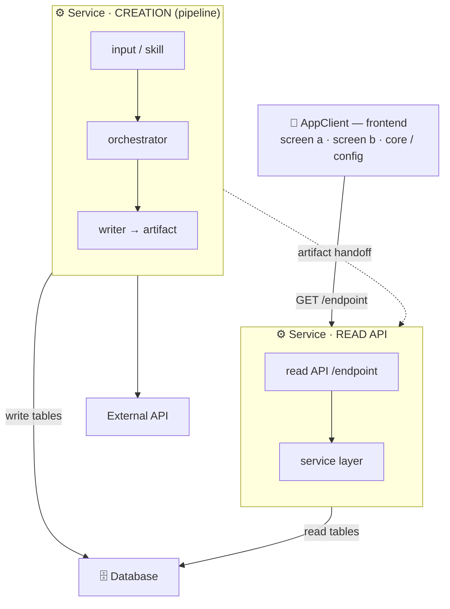
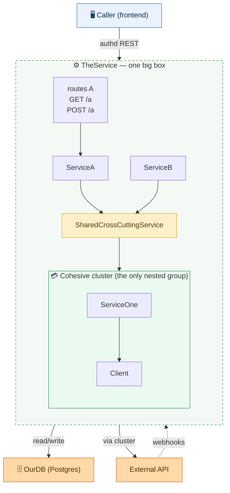
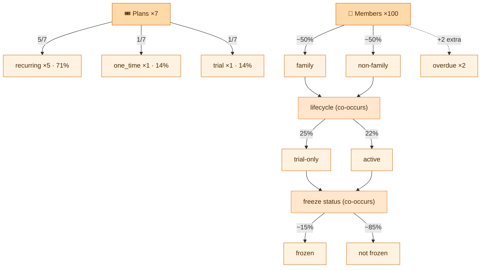

# Mermaid creation

How to author Mermaid graphs (architecture maps, system graphs, flowcharts). The goal is a graph that
shows real complexity but still renders fast and reads cleanly. Two throughlines run under everything:
**top-down, always** and **only siblings connect**.

This skill produces **three shapes of chart** (full guidance in *Chart shapes* below):

- **The system map** — many *systems* connected to each other (the whole product as boxes).
- **One system in depth** — a single system's internals (routes, services, modules, data access).
- **The breakdown / spread graph** — not systems or code, but the *spread of distinct things* a process
  produces (e.g. what a DB seed creates): each entity its own flat tree of types, arrow = local split,
  node = global share.

All obey *The rules*. When in doubt, copy the matching skeleton from *Snippets*. Keep every chart in
sync with the code — record the keep-updated rule in the relevant `CLAUDE.md`, and update the chart in
the same change as the code it describes.

## The rules

1. **Top-down, always.** Open with `flowchart TB` and put `direction TB` on **every** subgraph.
   **Never use `direction LR`** anywhere. Diagrams flow downward: sources/clients up top, the shared
   database and external services at the bottom.

2. **Only siblings connect (the containment rule).** An arrow may only connect two boxes that share
   the **same direct parent**.
   - Cross-system links happen at the **top level** — system box → system box (or system → external
     node), because those are all root siblings.
   - Links *inside* a box connect that box's **own** child nodes (e.g. a pipeline's own steps).
   - **Never** draw an arrow from a node inside one box to a node inside a different box. If A's
     internals depend on B, draw it as `A --> B` at the level where A and B are siblings, and let the
     label carry the detail.
   - Validate this mechanically (see *Workflow*). Zero violations is the bar.

3. **The color palette (fixed).** Use these and only these roles:
   - **Blue = client / frontend apps** (web app, admin dashboard, mobile app, marketing site).
   - **Green = backend services / engines.** For a service split into halves, the **creation /
     pipeline** side is the deeper green and the **read-API** side is the lighter green.
   - **Orange = the shared database AND every external third-party service** (a payment processor,
     LLM/AI providers, scrapers, font/asset CDNs, managed services). Data layer and externals are both orange.
   - **Yellow = the tooling (skills/scripts) that operates a generator.**
   Copy the `classDef` / `style` block from *Snippets* verbatim so colors stay consistent.

4. **Split genuinely-separate concerns into separate boxes.** When a service has two halves that don't
   call each other but hand off through an artifact — a write/generation pipeline that produces a file
   or DB table, and a read API that serves it — draw them as **two boxes** (e.g. `Service · CREATION`
   and `Service · READ API`) coupled only by a dashed artifact edge (e.g. `output.yaml`, `the X tables`).
   Don't fuse them into one box.

5. **Show the real inner nodes.** Open a system box up to its actual internal nodes (routers /
   services / SQL, orchestrator → modules → writer, schemas / RLS / enums / tables, etc.) — not a
   single label. Keep node labels short; group tightly-related files into one node with a `<br/>` list
   rather than ten tiny boxes.

6. **Edge semantics + labels.** **Solid arrow = a live runtime dependency** (HTTP call, DB read/write,
   third-party API). **Dashed arrow (`-.->`) = build-time, operational, or an artifact handoff** (a
   script operating a generator, a build-time asset capture, a file/table handoff, an inbound webhook).
   Put the contract on the label: an endpoint (`GET /things/{id}`), a table (`write the X tables`), or
   an artifact (`output.yaml`).

7. **Avoid horizontal sprawl.** In TB, `A --> B & C & D` fans modules into a wide row and blows up the
   width. To stack inner nodes vertically:
   - A group of items → **one node with `<br/>` lines** (e.g. `Box["feed<br/>detail<br/>config"]`).
     Stacks vertically, stays narrow, and renders on every Mermaid version.
   - A real pipeline → a chain: `A --> B --> C` (arrows are meaningful here).
   - **Do NOT use `~~~` invisible links.** `~~~` is Mermaid **10+ only**; on a Mermaid-9 previewer it
     throws a *lexical error* and the whole diagram renders **blank** (see rule 11). Use the `<br/>`
     node above for vertical lists instead.
   - Do **not** wrap tiers in `direction LR` subgraphs — that produces a many-thousand-px-wide smear.

8. **Don't draw graph-spanning lines.** If many boxes read from one shared sink (e.g. several clients
   all loading from a CDN), draw the *producing* edge and mention the consumption in the legend,
   instead of running long lines from the top of the graph to the bottom.

9. **Always include a legend** right under the diagram: what top-down means, the color roles, solid vs
   dashed, and the sibling rule. A reader should understand the conventions without reverse-engineering them.

10. **Aspect ratio.** Aim for a portrait or roughly-square shape (tall is fine for a README — you
    scroll down). If the rendered width-to-height ratio is worse than ~2.5:1, the layout is wrong —
    revisit rules 7 and 8.

11. **Compatibility — target Mermaid 9.** The renderers people actually view in (GitHub, the VS Code
    Markdown-Mermaid extension, Obsidian) often run **Mermaid 9**, while `mermaid-cli@latest` is
    Mermaid 11 and tolerates newer syntax. So a chart can render perfectly for you and be **blank for
    the user**. Avoid v10+-only syntax — above all **`~~~`**. Gate every chart on a Mermaid-9 parse
    (see Workflow).
    The v9 parse and the v11 render catch **different** errors — run **both** (Workflow steps 2 + 5),
    never just one. Three real gotchas that slip past one tool but not the other:
    - **Reserved-word node ids fail v9 only.** An id that *ends with* a bare flowchart keyword right
      before `[` — `class`, `end`, `style`, `graph`, `subgraph`, `default`, `click`, `href`, `call`,
      `linkStyle` — breaks the v9 lexer (`ac_class["..."]` → *Parse error … got 'CLASS'*) while v11
      accepts it silently. (`Classes` is fine — `class`+`es` isn't a word boundary; it's the *trailing
      bare word* that trips it.) Rename the id (e.g. `ac_attended`).
    - **Bare `%%` comment lines break the v11 render only.** A line containing *just* `%%` (an empty
      comment), especially in the header before `flowchart`, makes mermaid-cli collapse lines into
      `%%%%flowchart TB` → "Parse error on line 1"; v9 tolerates it. Never emit an empty `%%` line —
      always put text after `%%`.
    - **A stray `class <id> <className>;` resurrects a phantom empty node** if `<id>` no longer exists.
      When you delete a node, delete its `class …;` assignment in the same edit.

## Chart shapes: system map · one system in depth · breakdown graph

Same rules, three layouts. Pick by what the chart is *about*.

### A. The system map (many systems)

The whole product as boxes that talk to each other. Each top-level box is a **whole system**;
cross-system arrows connect systems (or a system → an external). A service that has a write/generation
pipeline and a read API splits into CREATION vs READ-API boxes (rule 4). This is the shape rules 1–11
describe by default.

### B. One system in depth (e.g. an API / backend)

Zooming into **one** system's internals (its routes, services, data access):

1. **One big box = the system; the caller and externals stay outside it.** Wrap *all* of the system's
   internals in a single subgraph. The caller (a frontend) and the external systems it depends on (the
   DB, a payment processor, an auth provider) are standalone nodes **outside** the box.
2. **Internals are flat.** Routes and every service are flat nodes inside the box — do **not** pre-group
   them by submodule/domain. Flatness is the point: a **cross-cutting component shows its real fan-in**
   (e.g. a payment-sync service called by several domains). Grouping by domain buries that.
3. **Nest only a genuinely-cohesive cluster.** The *one* allowed inner group is a tight subsystem — e.g.
   a payments/Stripe core (a client + its services), an auth subsystem, a vendor-SDK wrapper. Everything
   else stays flat. Resist re-grouping "for tidiness"; it hides the cross-cutting edges.
4. **Highlight the cross-cutting hubs.** Give a component that's called from many places a distinct
   color (e.g. a gold `classDef hub`) so the fan-in reads at a glance.
5. **Route external connections at the box level — one arrow per external.** Draw `Box --> Database`,
   `Box --> PaymentAPI`, `Caller --> Box`. Do **NOT** draw every internal service → the DB (the
   "million arrows" hairball), and do **NOT** invent an intermediary hub node (e.g. a connection pool)
   that everything points to — delete it and let the box own the external edge. Bonus: because no edge
   crosses the box boundary, the sibling rule is satisfied automatically (0 violations).
6. **Name the system's own datastore** so it's obviously "our DB" — one node (e.g. `Postgres`,
   `Supabase`) that everything funnels to.
7. **Generate from the source of truth; don't hand-invent edges.** If the framework wires dependencies
   in a DI/IoC container and declares routes in route files, parse those so the graph is provably
   accurate (which service is injected into which = the dependency edges; the routers = the route list).
8. **Ship two artifacts, kept in sync.** A **simple** overview in the system's `README.md`
   (`caller → system box → externals`, ~4 nodes) and the **detailed** `architecture.mermaid` next to it
   (the full flat-internals graph). Record the keep-updated rule in that system's `CLAUDE.md`.

### C. The breakdown / spread graph (a data taxonomy)

When the chart is about the *spread of distinct things a process produces* — what a DB seed creates,
the variant mix in a dataset, the type breakdown of some population — not systems or code:

1. **One independent tree per entity; the arrow is the split, the node is the global share.** Each
   entity (members, plans, classes…) is its own flat tree fanning to its types. The **edge label carries
   the local split** (share of its parent — e.g. `8%` of non-family); the **node carries the global
   share** (of the whole population — e.g. "never-started ~4% of members"). For a one-level split the two
   coincide; the distinction earns its keep on nested splits.
2. **Connect entities ONLY by a real model relationship — never a layout backbone.** Don't chain
   unrelated entities just to arrange them (a membership has no direct link to a class, so don't draw
   one). If the user says "separate graphs," that means genuinely disconnected trees. Linking entities
   should mean a real FK/ownership relationship or nothing.
3. **Exclusive facets = a simple fan; co-occurring facets = stacked, converging dimensions.** If each
   item is exactly ONE type (plan_type, activity type), fan the parent to those leaves. If every item has
   **all** the facets at once (a member is family/non-family AND has a lifecycle state AND is frozen-or-
   not AND has app-access-or-not — they co-occur), stack the dimensions vertically and reconverge each
   dimension's value-leaves into the **next dimension's hub node** (that hub *is* the join — no dot/`(( ))`
   nodes needed). Where two branches share a downstream, **converge** them into one child (family +
   non-family → one shared "membership lifecycle"). This reads as "every item flows through all of
   these," which a flat fan of exclusive leaves can't show.
4. **Three node tiers by shade.** Entity hub (deep orange `#ffd9a8`), a co-occurring dimension (medium
   `#ffe6cc`), a leaf type (light `#fff2e0`). A data taxonomy has no client/service, so it's mostly the
   orange (data) family — vary by **shade**, don't invent fake client/service roles to add color.
5. **Disconnected trees are inherently WIDE — surface the tradeoff, don't silently reshape.** Mermaid/
   dagre lays disconnected components **side-by-side in one row**; ~12 entities ≈ a 9000px strip (~7:1,
   violates rule 10). Adding a root does **not** shrink it — width is driven by total leaf spread, not
   connectivity (measured: a gym-root anchor gave *identical* width, just +1 rank of height). The only
   lever for a compact/portrait shape is **vertical serialization** of the entities — a backbone chain or
   stacked boxes — both of which contradict "keep them separate." So a "flat + each-type-a-node +
   entities-separate" graph is *fundamentally* a wide strip. Don't quietly add a backbone or boxes to
   fix it: put the tradeoff to the user (keep wide & separate · add a layout-only backbone · stack in
   boxes) and let them choose.

## Workflow

1. **Draft** the Mermaid following the rules. Start from the matching skeleton in *Snippets* (A or B).
2. **Render to validate it parses** (a parse error is invisible until you render):
   ```bash
   # writes graph.svg; non-zero exit or no svg = syntax error to fix
   npx -y @mermaid-js/mermaid-cli@latest -i graph.mmd -o graph.svg -b white \
     -p <(echo '{"args":["--no-sandbox"]}')
   grep -o 'viewBox="[^"]*"' graph.svg | head -1   # check aspect ratio
   ```
   Render a PNG (`-o graph.png -s 2`) and actually look at it before declaring done.
3. **Run the sibling-rule checker** — must report 0 violations:
   ```bash
   python3 scripts/check_siblings.py graph.mmd
   ```
   (script lives next to this SKILL.md) — caveat: it matches edges **non-overlapping**, so a single
   chained line `A --> B --> C --> D` only registers every *other* edge (`A->B`, `C->D`). Write **one
   edge per line** so every edge is actually checked (and the file diffs cleanly).
4. **Confirm top-down:** `grep -c "direction LR" graph.mmd` must be `0`.
5. **Compatibility gate (Mermaid 9):** `grep -c "~~~" graph.mmd` must be `0`. For certainty, parse the
   chart against Mermaid 9 (catches every v10+-only feature that would blank an older previewer):
   ```bash
   # scratch dir, once:  npm i mermaid@9 jsdom
   node -e "import('jsdom').then(async({JSDOM})=>{const d=new JSDOM('<!doctype html><body>');globalThis.window=d.window;globalThis.document=d.window.document;const m=(await import('mermaid')).default;m.initialize({startOnLoad:false});const fs=await import('fs');try{await m.parse(fs.readFileSync(process.argv[1],'utf8'));console.log('v9 PASS')}catch(e){console.log('v9 FAIL ::',String(e.str||e.message).split('\\n')[0])}})" graph.mmd
   ```
6. **Iterate** on layout until it's readable and the aspect ratio is sane.

## Snippets

**Skeleton — Shape A** (system map: top-down, a two-half service, sibling-only edges):


**Skeleton — Shape B** (one system in depth: big box, flat internals, one nested cluster, externals
outside, box-level external edges):


**Skeleton — Shape C** (breakdown / spread graph: separate per-entity trees, an exclusive fan vs.
stacked converging dimensions, three shade tiers, arrow = local split / node = global share):

(Note: Plans and Members are deliberately **disconnected** — separate entity trees, no cross-entity
backbone. Per Shape C rule 5 that makes the chart wide; serialize vertically only if the user opts in.)

**Palette block** (paste at the end of every diagram; assign nodes/subgraphs to roles):
```
  classDef client fill:#e3f0ff,stroke:#2f6fb0,color:#0b2942;
  classDef ext    fill:#ffd9a8,stroke:#d2691e,color:#4a2c08;
  %% subgraphs are colored with style <id> ...:
  %% client app box:        style X fill:#eaf2ff,stroke:#2f6fb0;
  %% service CREATION side:  style X fill:#dff0e6,stroke:#2f8f53;
  %% service READ-API side:  style X fill:#eafff2,stroke:#2f8f53;
  %% plain backend service:  style X fill:#e6f7ec,stroke:#2f8f53;
  %% database:               style X fill:#fff2e0,stroke:#c9781f;
  %% skills/scripts (tool):  style X fill:#fdf6d8,stroke:#caab2f;
  %% external nodes:         class A,B,C ext;   (orange — same as DB family)
```

## Notes

- These rules came from real iterations. **Shape A (system map):** an all-LR / tiered version sprawled
  past 10000px wide; a header-per-module fan-out was unreadable; arrows across subgraph boundaries broke
  the sibling rule; `~~~` blanked a Mermaid-9 previewer. **Shape B (one system):** pre-grouping internals
  by submodule hid a cross-cutting service's fan-in; an intermediary connection-pool hub created a
  hairball of arrows into the DB; the fix was flat internals + one nested cohesive cluster + box-level
  edges to a single named datastore node. The current rules are what fixed each.
- **Shape C (breakdown/spread graph)** came from mapping a DB seed's output (`Database/seed.mermaid`).
  Lessons baked into the rules above: a fake backbone chaining unrelated entities (membership → class)
  was wrong — entities must be separate trees joined only by real relationships; co-occurring member
  facets (family/non-family, lifecycle, freeze, app-access) read best as **stacked converging
  dimensions**, not a flat fan of mutually-exclusive leaves; fully-separate trees render as an
  unavoidably wide strip, so the width is a tradeoff to put to the user, not a bug to fix. The two
  compatibility gotchas (a reserved-word id `ac_class` that only **v9** rejected; a bare `%%` line that
  only the **v11** render rejected) are why rule 11 now insists on running *both* gates.
- This skill is a **living document**. If a rule here is wrong or a better convention emerges while
  making a diagram, use the better approach, then propose the fix and update this file (per the
  project's "skills are living documents" rule).
