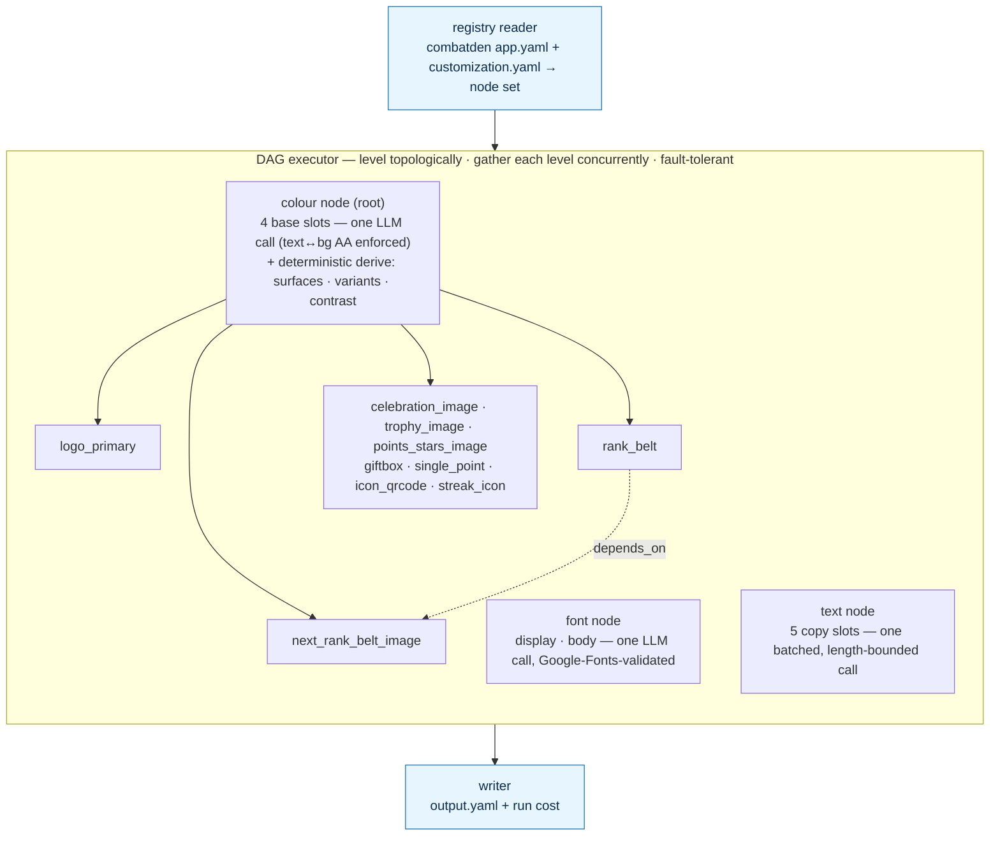
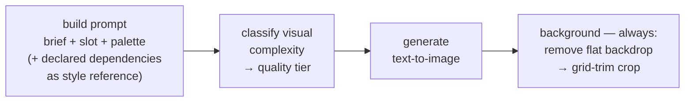

# AI Customization Pipeline

Takes a brand brief, produces a fully customized app.

---

## How it works

Two YAMLs you write (`app.yaml`, `customization.yaml`), one the pipeline
produces (`output.yaml`). Customized surface: **images, colors, fonts,
and text.**

The pipeline is a **dependency DAG**, not a fixed sequence. The registry
turns the two YAMLs into a node set — one **colour node**, one **font
node**, one **text node**, plus one **image node per image slot** — and
the executor levels that graph topologically and resolves each level
**concurrently**. Colour, font and text are the level-0 roots and run
side by side: the colour node resolves the four base slots in one
structured LLM call and then **derives the full palette deterministically**
(elevated surfaces, faded variants, contrast — see *Colour* below), the
font node picks every font in one call (validated live against the
Google Fonts catalogue), and the text node rewrites every copy slot in
one batched, length-bounded call. Every
image node depends on the colour node; the font and text nodes have no
dependents (the text node is built only when the app declares text
slots). An image slot may also declare
`depends_on` other image slots — used purely for **visual continuity**:
the dependency's look is folded into this slot's prompt as a style
reference (never fed in as an input image), which deepens the graph.

The graph is validated (acyclic, every dependency satisfied) **before
any paid call**. The run is then **fault-tolerant**: a node that fails
skips only its transitive dependents — every other image still resolves
and is written. The writer assembles whatever resolved into
`output.yaml` and totals what the run cost.

A concrete run — the `combatden` app (10 image slots, 4 colour slots,
2 font slots, 5 text slots, one declared `depends_on`):



Each image node resolves **one** image end to end (atomic; the executor
owns iteration):



> Entry point: `src/executor/orchestrator.py`. Provider choices (which
> model, which provider) are architecture, not pipeline logic. Each
> call's model id is a per-call constant at the top of the module that
> makes the call (`color_node.py`, `image_node.py`,
> `complexity_service.py`, `background_service.py`,
> `font_selection_service.py`, `text_generation_service.py`), not a
> config/env knob; only secrets (API keys) stay in `config.py`. Image
> generation
> goes through a generic litellm generator, so the image model
> (`openai/gpt-image-2` today) is just one of those per-call constants
> — swapping providers is a one-line change. Generation is
> text-to-image only: there is no style-adherence check and no
> corrective edit (removed — extra paid calls for marginal gain), and
> declared dependencies are folded into the prompt as reference, never
> fed in as input images. The background pass (remove → two-pass
> grid-trim crop) is its own `BackgroundService` and runs no
> cutout-quality check. Cost is estimated from litellm's own
> per-response pricing (plus a flat per-call rate for background
> removal); there is no hand-maintained price table. Fonts and text are
> Haiku structured-selection calls with their own correctness loops: the
> font pick must be a real Google Fonts family (rejected picks ride the
> retry loop) and each text slot must land inside its declared
> word/character bounds (over-long slots are re-asked, then dropped so
> the client falls back to bundled copy).

---

## Colour: one paid call, the rest derived

A usable theme is far more than four brand colours. A real UI needs
elevated **card** and **popup** surfaces, **dividers**, dark/light
variants, and faded secondary/tertiary text — and every one of those has
to stay legible on whatever background the brand picked. The pipeline
owns all of it, so each client reads a finished palette instead of
re-deriving (and re-guessing) surfaces itself.

The single colour LLM call resolves only the **four base slots**
(`primary`, `background`, `text`, `accent`) as OKLCH values, under a
contract checked **before the result is accepted**: `text` must clear
**WCAG AA (4.5:1)** against `background`, text lightness is pinned by
mode (near-white in dark, near-black in light), and base colours stay
low-chroma. A breach rides the same retry loop and is re-asked.

Everything else is computed in Python — **no extra LLM calls, fully
deterministic and repeatable**:

- **Background correction** clamps the canvas lightness into a safe band
  so elevated surfaces have tonal headroom (dark mode pulls it down,
  light mode pulls it up).
- **Per-slot derivation** expands each base slot into seven variants:
  `second`/`third` (faded alpha tints for secondary/tertiary text),
  `card`/`popup` (translucent and opaque surfaces), `dark`/`light`
  (lightness-shifted variants forced to read clearly above or below the
  canvas), and `regular_text` (a readable foreground for text painted ON
  the colour — the body `text` colour if it clears WCAG AA against the
  fill, else whichever of text/background contrasts better).
- **Shared surfaces** computes the run-wide `card` (neutral elevation
  veil), `popup` (that veil composited onto the canvas), and `divider`
  (a hairline keyed to the text colour) once for the whole theme.

The run carries one resolved **`mode`** (light or dark) and emits a flat,
ready-to-consume palette (`primary`, `primary_card`, `background_dark`,
`card`, `divider`, …). This is what lets the client become a plain
consumer — the interim surface math each client used to carry is gone.

---

## App-agnostic by construction

The pipeline knows nothing about any specific app. The slot inventory,
slot names, slot descriptions, and the image→image `depends_on` edges
live entirely in `app.yaml`. Point the same pipeline code at a different
`app.yaml` and you customize a different app — no code changes, no
rebuild, one new YAML directory.

That's the success criterion. The framework stays one codebase; every
new app is one new `apps/<app_id>/` folder.

---

## TODO

Both **deferred** — each needs a hand-curated catalogue (a vetted list to
download / pick from) before it's worth building, and the shipped surface
(images, colours, fonts, text) is already enough to validate the product.
Not going deeper until validation says to.

1. **Lottie animation customization.** Resolve brand-appropriate Lottie
   animations per slot. Deferred: needs a hand-curated source list first.
2. **Icon set customization.** Resolve a brand-fitting icon set. Deferred:
   same reason — the icon catalogue has to be hand-curated before the
   module is worth writing.

---

## Shipped

```
codebase/CustomizationService/
├── schema/              # Pydantic contracts for the YAMLs
│   ├── app_format, customization, primitives, slots,
│   │     color_role, complexity
│   └── output/          # ColorOutput (+ Derivations), ColorValue,
│   │                    #   ImageOutput, FontOutput, TextOutput,
│   │                    #   *Set wrappers (ColorPalette has mode),
│   │                    #   Output, RunCost
├── src/
│   ├── __main__, cli    # CLI entrypoint
│   ├── core/            # config, errors, run_context, logging, util
│   ├── executor/        # orchestrator (the DAG), registry, writer
│   ├── modules/         # base = Node + DependencyKind
│   │   ├── colors/      # ColorNode + scheme (LLM) / correction /
│   │   │                #   derivation / surface services, prompts/*.md
│   │   ├── images/      # ImageNode + complexity /
│   │   │                #   background services, prompts/*.md
│   │   ├── fonts/       # FontNode + font selection service
│   │   │                #   (Google Fonts catalog), prompts/*.md
│   │   └── texts/       # TextNode + text generation service, prompts/*.md
│   ├── shared/
│   │   ├── interfaces/  # LLMClient, ImageGenerator, BackgroundRemover
│   │   └── services/    # LiteLLMClient, LiteLLMImageGenerator,
│   │                    #   PhotoRoom remover, cost, prompts/*.md
│   └── api/             # read-only FastAPI over output.yaml
├── tests/               # core, modules, executor, pipeline, services, api
├── scripts/             # dev model bake-off
└── apps/
    ├── combatden/       # app.yaml, customization.yaml, runs
    └── smoketest/       # app.yaml, customization.yaml, runs
```

`make test` runs the suite; `make run` customizes `apps/combatden/` end
to end, `make smoke` does the same on `apps/smoketest/`; `make api`
serves the read-only output API. Entry point:
`src/executor/orchestrator.py`. Read the schemas for the exact YAML
shapes; read `apps/combatden/` for a worked example.
