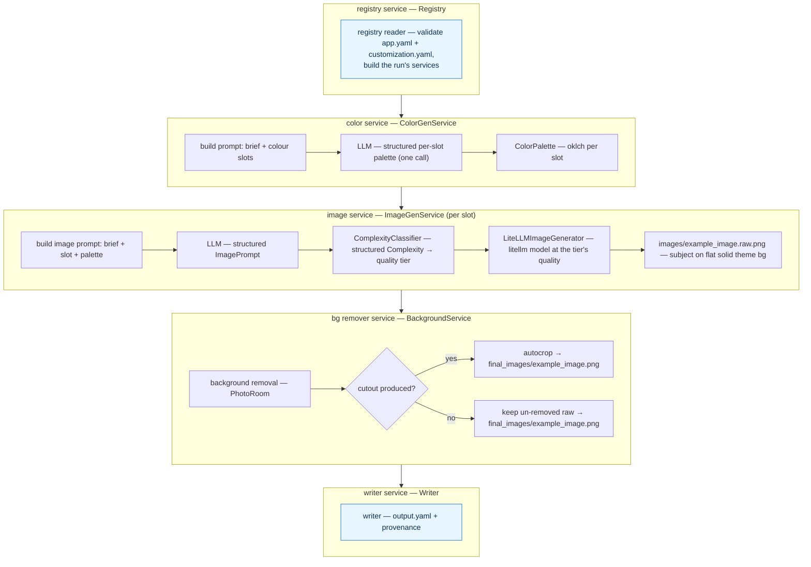

# AI Customization Pipeline

Takes a brand brief, produces a fully customized app.

---

## How it works

Two YAMLs you write (`app.yaml`, `customization.yaml`), one the pipeline
produces (`output.yaml`). Customized surface: **images and colors.**

The colour step resolves every colour slot in one structured LLM call; the
image step then resolves each image slot end to end (prompt → classify →
generate → background-remove → crop), and the results are assembled into
`output.yaml`.

Five services run in sequence (the graph below):

- **registry reader** — validates the two YAMLs and builds the run's
  services.
- **color service** — resolves the whole palette in one structured LLM
  call (oklch per slot).
- **image service** (per image slot) — writes an image prompt from the
  brief + slot + palette, classifies the prompt's visual complexity to
  pick a generation **quality tier**, then generates the image on a flat
  solid theme background.
- **bg remover service** — strips that flat background to a transparent
  cutout and tight-crops it; if removal fails it keeps the raw image.
- **writer** — assembles colours + per-image results into `output.yaml`
  alongside the provenance of the inputs that produced them.

Each module is **atomic** (one palette; one image) and returns a typed
Pydantic model; the executor owns iteration. Which model each call uses is
a per-call constant in that module, not config (see the note under the
graph). Slots resolve sequentially today — concurrency is on the roadmap.



> Entry point: `src/executor/orchestrator.py`. Provider choices
> (which model, which provider) are architecture, not pipeline
> logic — they're intentionally not in this diagram. Each call's
> model id is a per-call constant at the top of the module that
> makes the call (`color_service.py`, `image_service.py`,
> `complexity_service.py`, `background_service.py`), not a
> config/env knob; only secrets (API keys) stay in `config.py`.
> Image generation goes through a generic litellm generator, so the
> image model (`openai/gpt-image-2` today) is just one of those
> per-call constants — swapping providers is a one-line change. The
> background pass (remove → crop, no per-image quality check) is its
> own `BackgroundService`. These constants are optional call overrides
> so dev bake-off scripts under `scripts/` can compare models.

---

## App-agnostic by construction

The pipeline knows nothing about any specific app. The slot list, slot
names, and slot descriptions live entirely in `app.yaml`. Point the same
pipeline code at a different `app.yaml` and you customize a different app
— no code changes, no rebuild, one new YAML directory.

That's the success criterion. The framework stays one codebase; every new
app is one new `apps/<app_id>/` folder.

---

## Shipped

```
codebase/AICustomizationPipeline/
├── schema/              # Pydantic contracts for the three YAMLs
│   ├── app_format, customization, primitives, slots
│   └── output/          # ColorOutput, ImageOutput, Output
├── src/
│   ├── __main__, cli            # entrypoint
│   ├── core/            # config, errors, run_context, imaging, logging
│   ├── executor/        # orchestrator (the pipeline), registry, writer
│   ├── modules/
│   │   ├── colors/      # ColorGenService, color_models, prompts/*.md
│   │   └── images/      # ImageGenService, image_models, prompts/*.md
│   └── shared/
│       ├── interfaces/  # LLMClient, ImageGenerator, BackgroundRemover
│       └── services/    # LiteLLMClient, BflImageGenerator,
│                        #   PhotoRoomBackgroundRemover, prompts/*.md
├── tests/               # core, modules, pipeline, services
└── apps/
    ├── combatden/       # app.yaml, customization.yaml, output.yaml
    └── smoketest/       # app.yaml, customization.yaml
```

`make test` runs the suite; `make smoke` runs the pipeline end to end on
`apps/smoketest/`. Entry point: `src/executor/orchestrator.py`. Read the
schemas for the exact YAML shapes; read `apps/combatden/` for a worked
example.

---

## Roadmap / TODO

The first real end-to-end run validated quality and style: the prompts
produce genuinely strong, style-consistent outputs. The remaining gaps are
**speed** (slot resolution is sequential), a **style** safety net, and a
**tighter crop**. Nothing below is implemented yet.

### 1. DAG execution engine with bounded concurrency

The pipeline is correct but slow because the executor resolves slots one
at a time. Replace the hand-rolled orchestrator with a dependency DAG that
runs each level in parallel (a bounded gather). Module-level atomicity is
already in place, which makes this tractable — but it is still the larger,
more intricate piece of work, and the prerequisite for the speed win:

- **One node per unit of work.** Each image gets its **own node class** —
  not a single `ImageGenService` reused via different `run(...)` args.
- **Typed contracts.** Every node takes required, named inputs and returns
  a single Pydantic model (already true today), so inputs and outputs are
  predictable and validated at the boundary.
- **Explicit dependencies — not name-matched.** The engine does **not**
  infer edges from kwarg names. `color` is an automatic dependency of
  every image node. **Image→image** dependencies are declared by the
  user: an image node takes an optional
  `dependant_image: list[ImageOutput]` input carrying the outputs of the
  images it depends on, so one image can build on others.
- **Registry emits the node set.** The registry returns a dict of every
  node to run for the app; the engine levels them topologically and
  gathers each level concurrently.
- **Fault-tolerant — never lose finished work.** A node failure does not
  abort the run. The engine runs every node it still can (skipping only
  the failed node's dependents), then writes whatever succeeded to
  `output.yaml`. One bad slot must not throw away every other finished
  image — increasingly important as the pipeline grows.

### 2. Style-adherence validation + conditional edit (NOT quality)

Reinstate the image validation step that is currently bypassed — but
strictly scoped to **style adherence**, never quality:

- **Explicit non-goal: quality.** Judging "is this good enough" is a
  slippery slope that ends in unbounded regeneration. Do not do it.
- **In scope: does the image match the intended style?** A structured
  verdict on style alignment only.
- **On mismatch → edit, not regenerate.** If the image is off-style, fix
  it with an image **edit** (nano-banana and Claude image edit) toward
  the target style. A corrective alignment step, not a quality loop.

### 3. Tighter crop — grid-based transparency trim

The current autocrop (the first crop — `autocrop` in
`src/core/imaging.py`) gets stuck on **slightly-non-transparent fringe**:
faint low-alpha halo left by background removal keeps the bounding box
loose. Add a second, grid-based pass that runs **after** the existing
crop and trims those regions:

- Walk the already-cropped image as a grid of cells.
- A cell is marked **bad (halo → removed) only if BOTH** signals fail —
  it is `and`, not `or`:
  - **≥90%** of the cell's pixels are effectively transparent, **and**
  - across the pixels that *do* carry alpha, the **average** alpha is
    **≤5%**.
- If only one holds, keep the cell — it still carries real subject.
- Re-crop tight to whatever survives.

This refines the existing crop — it does not replace it.
