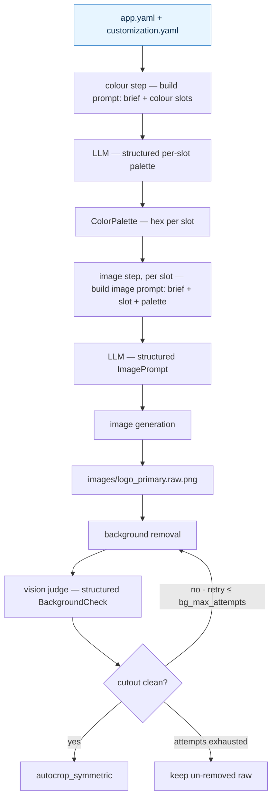

# AI Customization Pipeline

Takes a brand brief, produces a fully customized app.

---

## How it works

Two YAMLs you write (`app.yaml`, `customization.yaml`), one the pipeline
produces (`output.yaml`). Customized surface: **images and colors.**

The colour step resolves every colour slot in one structured LLM call; the
image step then resolves each image slot end to end (prompt → generate →
background-remove → validate → crop), and the results are assembled into
`output.yaml`.



> Entry point: `src/executor/orchestrator.py`. Provider/transport choices
> (which model, proxy vs. direct calls) are architecture, not pipeline
> logic — they're intentionally not in this diagram.

---

## App-agnostic by construction

The pipeline knows nothing about any specific app. The slot list, slot
names, and slot descriptions live entirely in `app.yaml`. Point the same
pipeline code at a different `app.yaml` and you customize a different app
— no code changes, no rebuild, one new YAML directory.

That's the success criterion. The framework stays one codebase; every new
app is one new `apps/<app_id>/` folder.

---

## Shipped

```
codebase/AICustomizationPipeline/
├── schema/              # Pydantic contracts for the three YAMLs
│   ├── app_format, customization, primitives, slots
│   └── output/          # ColorOutput, ImageOutput, Output
├── src/
│   ├── __main__, cli            # entrypoint
│   ├── core/            # config, errors, run_context, imaging, logging
│   ├── executor/        # orchestrator (the pipeline), registry, writer
│   ├── modules/
│   │   ├── colors/      # ColorGenService, color_models, prompts/*.md
│   │   └── images/      # ImageGenService, image_models, prompts/*.md
│   └── shared/
│       ├── interfaces/  # LLMClient, ImageGenerator, BackgroundRemover
│       └── services/    # ProxyLLMClient, BflImageGenerator,
│                        #   PhotoRoomBackgroundRemover, prompts/*.md
├── tests/               # core, modules, pipeline, services
└── apps/
    ├── combatden/       # app.yaml, customization.yaml, output.yaml
    └── smoketest/       # app.yaml, customization.yaml
```

`make test` runs the suite; `make smoke` runs the pipeline end to end on
`apps/smoketest/`. Entry point: `src/executor/orchestrator.py`. Read the
schemas for the exact YAML shapes; read `apps/combatden/` for a worked
example.

---

## Roadmap / TODO

### 0. Post-generation colour validation — top priority

All MCP wiring (and `vendor/colormcp`) was removed: the proxy never
actually invoked it on completions, so it was dead/ineffective. Replace
the lost intent with a deterministic, **tool-free** check — after
`ColorGenService` returns the palette, compute WCAG contrast in pure
Python (relative-luminance math, ~10 lines) for each text↔background
companion; on an AA miss (< 4.5:1) feed it back and re-ask, the same
retry pattern the structured loop already uses. No LLM tools, no MCP.

### 1. Harden existing prompts — prerequisite for the validation loop

Before any new LLM step is added, tighten every prompt currently in the
tree so they're robust and produce reliable structured output:

- `src/modules/colors/prompts/color_palette_rule.md`
- `src/modules/images/prompts/image_prompt_rule.md`
- `src/modules/images/prompts/background_check.md`
- `src/shared/services/prompts/schema_correction.md`

### 2. Mobile-ready validation loop (new feature — not started)

A judge over the **freshly generated** image — right after the first
image generation, before background removal — in two independently-shippable
parts:

**Part 1 — LLM-as-judge live classification.** Immediately after image
generation (not after the slot resolves), ask a vision LLM whether the
generated image is *mobile-ready*:

- subject centered both vertically and horizontally,
- minimal / clean background (nothing busy),
- nothing bleeding into or attached to the page edges,
- (other framing/safe-area checks as needed).

Returns a structured verdict.

**Part 2 — nano-banana conditional editing.** Extend the verdict so the
judge also returns `editable` + concrete edit instructions:

- if **editable** → targeted fix via **nano-banana** (Gemini image edit)
  rather than a full regenerate,
- if **not editable** → regenerate from scratch.

When this is built, the **image-regeneration limit** should be **5** — a
new, regen-specific config setting, distinct from `bg_max_attempts` and
`llm_max_retries` (those stay at 3).

Sits in the per-slot image loop **right after generation and before
background removal**, as its own edit/regenerate retry loop (separate from
the existing background-removal retry downstream). Blocked on the Gemini
image-gen billing access (see `docs/`) and on item 0.
