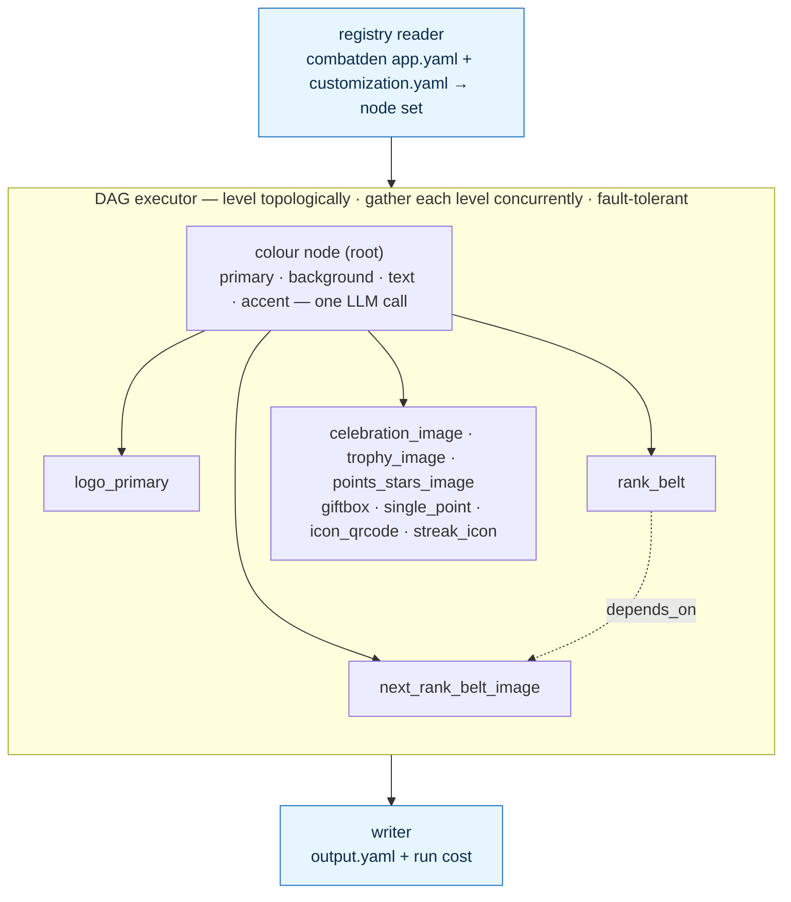
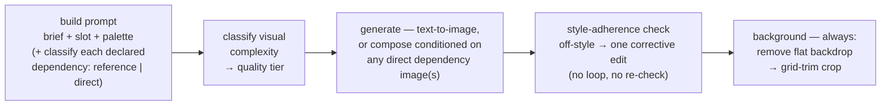

# AI Customization Pipeline

Takes a brand brief, produces a fully customized app.

---

## How it works

Two YAMLs you write (`app.yaml`, `customization.yaml`), one the pipeline
produces (`output.yaml`). Customized surface: **images and colors.**

The pipeline is a **dependency DAG**, not a fixed sequence. The registry
turns the two YAMLs into a node set — one **colour node** plus one
**image node per image slot** — and the executor levels that graph
topologically and resolves each level **concurrently**. The colour node
is the root: it resolves the whole palette in one structured LLM call,
and every image node depends on it. An image slot may also declare
`depends_on` other image slots (visual continuity, or one asset feeding
another), which deepens the graph.

The graph is validated (acyclic, every dependency satisfied) **before
any paid call**. The run is then **fault-tolerant**: a node that fails
skips only its transitive dependents — every other image still resolves
and is written. The writer assembles whatever resolved into
`output.yaml` and totals what the run cost.

A concrete run — the `combatden` app (10 image slots, 4 colour slots,
one declared `depends_on`):



Each image node resolves **one** image end to end (atomic; the executor
owns iteration):



> Entry point: `src/executor/orchestrator.py`. Provider choices (which
> model, which provider) are architecture, not pipeline logic. Each
> call's model id is a per-call constant at the top of the module that
> makes the call (`color_node.py`, `image_node.py`,
> `complexity_service.py`, `style_service.py`,
> `background_service.py`), not a config/env knob; only secrets (API
> keys) stay in `config.py`. Image generation goes through a generic
> litellm generator, so the image model (`openai/gpt-image-2` today) is
> just one of those per-call constants — swapping providers is a
> one-line change. The style check is **style adherence only, never
> quality**: a single corrective edit on a miss, never a regeneration
> loop. The background pass (remove → two-pass grid-trim crop) is its
> own `BackgroundService` and runs no cutout-quality check. Cost is
> estimated from litellm's own per-response pricing (plus a flat
> per-call rate for background removal); there is no hand-maintained
> price table.

---

## App-agnostic by construction

The pipeline knows nothing about any specific app. The slot inventory,
slot names, slot descriptions, and the image→image `depends_on` edges
live entirely in `app.yaml`. Point the same pipeline code at a different
`app.yaml` and you customize a different app — no code changes, no
rebuild, one new YAML directory.

That's the success criterion. The framework stays one codebase; every
new app is one new `apps/<app_id>/` folder.

---

## Shipped

```
codebase/CustomizationService/
├── schema/              # Pydantic contracts for the YAMLs
│   ├── app_format, customization, primitives, slots,
│   │     color_role, complexity, dependency_usage
│   └── output/          # ColorOutput, ImageOutput, Output, RunCost
├── src/
│   ├── __main__, cli    # CLI entrypoint
│   ├── core/            # config, errors, run_context, logging, util
│   ├── executor/        # orchestrator (the DAG), registry, writer
│   ├── modules/         # base = Node + DependencyKind
│   │   ├── colors/      # ColorNode, color_models, prompts/*.md
│   │   └── images/      # ImageNode + complexity / style /
│   │                    #   background services, prompts/*.md
│   ├── shared/
│   │   ├── interfaces/  # LLMClient, ImageGenerator, BackgroundRemover
│   │   └── services/    # LiteLLMClient, LiteLLMImageGenerator,
│   │                    #   PhotoRoom remover, cost, prompts/*.md
│   └── api/             # read-only FastAPI over output.yaml
├── tests/               # core, modules, executor, pipeline, services, api
├── scripts/             # dev model bake-off
└── apps/
    ├── combatden/       # app.yaml, customization.yaml, runs
    └── smoketest/       # app.yaml, customization.yaml, runs
```

`make test` runs the suite; `make run` customizes `apps/combatden/` end
to end, `make smoke` does the same on `apps/smoketest/`; `make api`
serves the read-only output API. Entry point:
`src/executor/orchestrator.py`. Read the schemas for the exact YAML
shapes; read `apps/combatden/` for a worked example.

## Roadmap / TODO

### 1. Per-model cost breakdown in the output

Cost tracking today (`src/shared/services/cost.py` → `CostTracking`
mixin → `PipelineResult` → `src/executor/writer.py`) sums one running
total per paid *service* into `RunCost`. Extend it to also record cost
**per model id** — image-gen model, prompt LLM, classify LLM,
nano-banana edit — and emit that breakdown in `output.yaml` alongside
the existing totals, so a run shows exactly what each model spent.
litellm already returns per-call cost for every model id
(provider-prefixed included), so this is an accumulation/shape change
on `RunCost`, not new pricing data.

### 2. Persist every image variant — never overwrite on nano-banana regen

The image node runs `generate → style check → (one-time edit) → cutout
→ crop` (`src/modules/images/image_node.py`); the nano-banana edit and
the cutout/crop steps write over earlier PNGs, so the raw generation
and pre-edit frames are lost. Persist **every** intermediate (raw
generation, post-edit, post-cutout, final) under distinct per-slot
filenames and never overwrite when nano-banana regenerates — keep the
full lineage on disk for inspection and debugging. The output still
points at the final image; the extra frames sit beside it.
