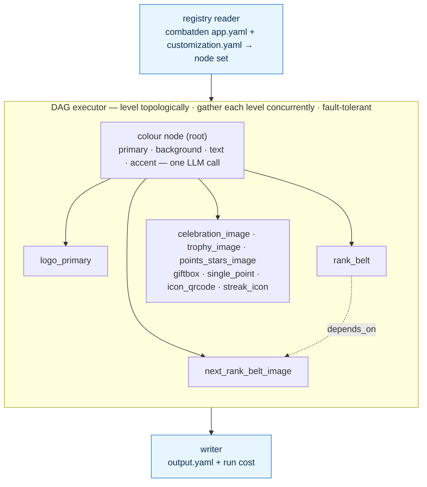
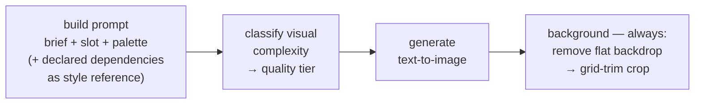

# AI Customization Pipeline

Takes a brand brief, produces a fully customized app.

---

## How it works

Two YAMLs you write (`app.yaml`, `customization.yaml`), one the pipeline
produces (`output.yaml`). Customized surface: **images and colors.**

The pipeline is a **dependency DAG**, not a fixed sequence. The registry
turns the two YAMLs into a node set — one **colour node** plus one
**image node per image slot** — and the executor levels that graph
topologically and resolves each level **concurrently**. The colour node
is the root: it resolves the whole palette in one structured LLM call,
and every image node depends on it. An image slot may also declare
`depends_on` other image slots — used purely for **visual continuity**:
the dependency's look is folded into this slot's prompt as a style
reference (never fed in as an input image), which deepens the graph.

The graph is validated (acyclic, every dependency satisfied) **before
any paid call**. The run is then **fault-tolerant**: a node that fails
skips only its transitive dependents — every other image still resolves
and is written. The writer assembles whatever resolved into
`output.yaml` and totals what the run cost.

A concrete run — the `combatden` app (10 image slots, 4 colour slots,
one declared `depends_on`):



Each image node resolves **one** image end to end (atomic; the executor
owns iteration):



> Entry point: `src/executor/orchestrator.py`. Provider choices (which
> model, which provider) are architecture, not pipeline logic. Each
> call's model id is a per-call constant at the top of the module that
> makes the call (`color_node.py`, `image_node.py`,
> `complexity_service.py`, `background_service.py`), not a config/env
> knob; only secrets (API keys) stay in `config.py`. Image generation
> goes through a generic litellm generator, so the image model
> (`openai/gpt-image-2` today) is just one of those per-call constants
> — swapping providers is a one-line change. Generation is
> text-to-image only: there is no style-adherence check and no
> corrective edit (removed — extra paid calls for marginal gain), and
> declared dependencies are folded into the prompt as reference, never
> fed in as input images. The background pass (remove → two-pass
> grid-trim crop) is its own `BackgroundService` and runs no
> cutout-quality check. Cost is estimated from litellm's own
> per-response pricing (plus a flat per-call rate for background
> removal); there is no hand-maintained price table.

---

## App-agnostic by construction

The pipeline knows nothing about any specific app. The slot inventory,
slot names, slot descriptions, and the image→image `depends_on` edges
live entirely in `app.yaml`. Point the same pipeline code at a different
`app.yaml` and you customize a different app — no code changes, no
rebuild, one new YAML directory.

That's the success criterion. The framework stays one codebase; every
new app is one new `apps/<app_id>/` folder.

---

## TODO

1. **Own the resolved surface set, with guaranteed contrast.** Today the
   client (MobileApp) *derives* its surfaces from the four base slots —
   the elevation card/popup (a translucent white veil over the canvas),
   the `divider`, and a primary-tinted card — as best-effort, per-app
   math. That logic belongs here, where palettes are generated, so it
   generalises across every app instead of being re-implemented (and
   re-guessed) in each client. The pipeline should resolve and emit the
   full surface set (e.g. `surface`/`card`, `primary_card`, `divider`,
   `popup`) alongside the base slots, each computed for the resolved
   light/dark `mode`. As part of this it must guarantee on-surface
   contrast the client structurally cannot: (a) a primary-derived
   surface that carries both `primary`-as-accent and the body `text`
   colour at WCAG AA (4.5:1); and (b) `primary` against the resolved
   `background` itself — primary-coloured UI placed directly on the
   canvas (active tab underline, active nav item, icons) must clear
   contrast too. The same applies to `accent` vs `background`. (b) is
   exactly what failed in the original light preset: the yellow
   accent/primary washed out on the cream background. The client cannot
   solve (a): when a preset's `text` and `primary` sit on opposite
   luminance sides (e.g. Duck Groove — dark slate text, bright yellow
   primary) no single surface lightness clears 4.5:1 against both, so
   any client solve just clamps and one fails AA. Resolve all of it at
   generation time (validate/clamp the palette and steer the
   colour-generation prompt) so `text`, `primary`, `accent` and
   `background` land on contrast-safe relationships. Builds on the
   shipped background-lightness band; once this ships, the client's
   interim surface math (incl. `primaryCard`) is deleted and the client
   becomes a plain consumer.

---

## Shipped

```
codebase/CustomizationService/
├── schema/              # Pydantic contracts for the YAMLs
│   ├── app_format, customization, primitives, slots,
│   │     color_role, complexity
│   └── output/          # ColorOutput, ImageOutput, Output, RunCost
├── src/
│   ├── __main__, cli    # CLI entrypoint
│   ├── core/            # config, errors, run_context, logging, util
│   ├── executor/        # orchestrator (the DAG), registry, writer
│   ├── modules/         # base = Node + DependencyKind
│   │   ├── colors/      # ColorNode, color_models, prompts/*.md
│   │   └── images/      # ImageNode + complexity /
│   │                    #   background services, prompts/*.md
│   ├── shared/
│   │   ├── interfaces/  # LLMClient, ImageGenerator, BackgroundRemover
│   │   └── services/    # LiteLLMClient, LiteLLMImageGenerator,
│   │                    #   PhotoRoom remover, cost, prompts/*.md
│   └── api/             # read-only FastAPI over output.yaml
├── tests/               # core, modules, executor, pipeline, services, api
├── scripts/             # dev model bake-off
└── apps/
    ├── combatden/       # app.yaml, customization.yaml, runs
    └── smoketest/       # app.yaml, customization.yaml, runs
```

`make test` runs the suite; `make run` customizes `apps/combatden/` end
to end, `make smoke` does the same on `apps/smoketest/`; `make api`
serves the read-only output API. Entry point:
`src/executor/orchestrator.py`. Read the schemas for the exact YAML
shapes; read `apps/combatden/` for a worked example.
