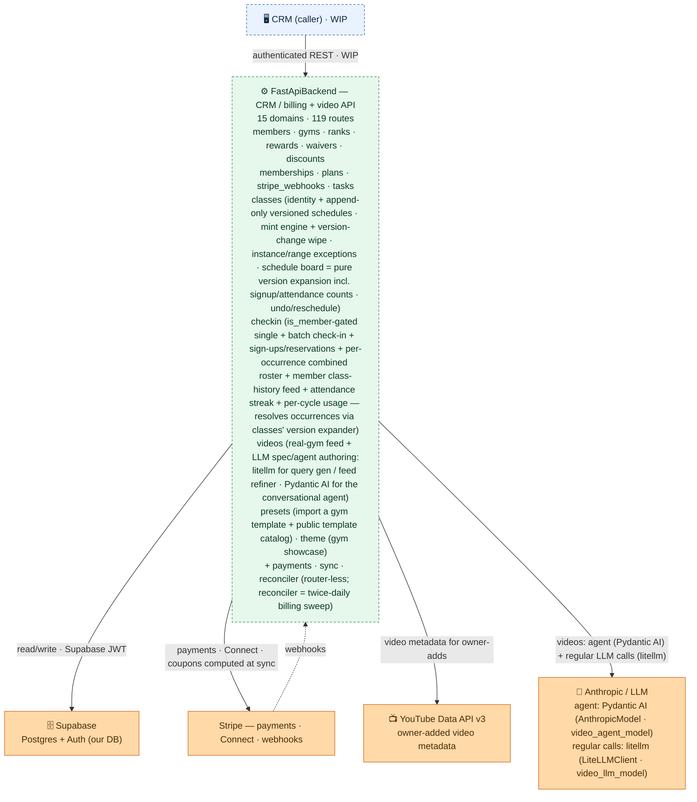

# FastApiBackend — CombatDen API

The membership + billing backend for CombatDen: a Python/FastAPI service that the **CRM** calls to
manage gyms, members, classes, ranks, rewards, Stripe-backed billing, and gym **video content** (the
merged VideoService read API + the gym-template preset import). It owns no UI — it is a read/write
REST API over the shared Supabase Postgres, authenticated with Supabase JWTs.

> **Status: WIP, not yet deployed** (prod target `api.combatden.net`). The CRM is its first client
> and is still being wired up. See `../README.md` for where this sits in the whole system, and
> `CLAUDE.md` here for coding standards.

---

## Architecture (overview)



The CRM calls this API; it reads/writes the shared **Supabase** Postgres (auth via Supabase JWT) and
talks to **Stripe** for payments, Connect onboarding, and inbound webhooks. Dashed = WIP / inbound.

**For the full internal graph** — every route, the service classes, the grouped **Payments** Stripe
core, the cross-cutting **`PaymentSyncService`** (the declarative reconciler called by three domains —
it re-derives each payer's desired Stripe state from the DB and converges Stripe onto it), and the
shared **`PayerResolver`** — see
**[`architecture.mermaid`](architecture.mermaid)** (generated from the DI wiring; render it with the
`mermaid-creation` skill).

**For the payment-sync engine in depth** — the step-by-step orchestration flow of
`update_payments_recurring` (resolve → build + resolve coupons (freeze = a 100%-off line) →
execute → write back, returning `None`), plus the `preview` / `bulk` / deferred-reconciler branches —
see
**[`payment_sync.mermaid`](payment_sync.mermaid)**. The sync steps are grouped in one box with
**Supabase** + **Stripe** as outside actors and box-level edges (same convention as
`architecture.mermaid`). Green = the engine's steps / entry points, orange = the external actors;
solid = a live runtime call, dashed = future / shared-code. Deep engine knowledge lives in the
`sync-guide` skill.

**For the scheduled reconciler in depth** — the twice-daily sweep flow (scheduler → invoice-fetch → stale-task recovery → orphan-clean → push, whose sync self-heals a gone subscription, → subscription-orphans, which cancels live Stripe subs with no live DB link), and the webhook `record` seam — see **[`reconciler.mermaid`](reconciler.mermaid)** (owned by the `reconciler-guide` skill).

**Invoice absorption fast path:** right after any invoice-creating membership op (`charge_card`, `start`, `upgrade`, prorating reprice, `mark-paid-cash`), a **deterministic post-op invoice fetch** fires fire-and-forget — it pulls that payer's new invoices from Stripe immediately and applies them via the same idempotent webhook `record()` seams, without waiting for the `invoice.paid` / `invoice_payment.paid` webhooks. Webhooks + the twice-daily reconciler sweep remain backstops. See `memberships-guide`.

---

## How a request flows

1. **`main.py` bootstraps the app** — `create_app()` builds the `dependency-injector` container, applies CORS, mounts every domain router, and (on shutdown) disposes the async DB pool. `GET /health` is unauthenticated.
2. **A router handles the route** under `/api/v1/<domain>`. Every protected route takes `HTTPBearer` credentials, and an injected `Auth` (`shared/auth.py`) verifies the **Supabase JWT** against the project JWKS.
3. **The router calls a DI-injected service** (`Depends(Provide[DependencyInjector.<service>])`). Services hold the business logic; the **`payments` package is a router-less Stripe core** injected into the billing domains rather than mounted.
4. **Services run domain SQL** from `<domain>/sql/*.sql` (never inline — see conventions) over the **async SQLAlchemy + asyncpg** session from `shared/database.py`, guarded by `column_guard` for immutable columns.
5. **External calls** go to **Stripe** (payments, Connect onboarding, and inbound webhooks landing on `POST /api/v1/stripe/webhooks`) and **Supabase** (Postgres data + Auth JWKS).

## Domains

Each domain is a vertical slice — `router/ + schema/ + service/ + sql/` — under `src/<domain>/`. The full chart lists each one's routes and services; this is what each is *for*:

| Domain | What it does |
|---|---|
| `members` | Member records + management + billing detail (profile, card, Stripe customer, invoices); **payer authorization**: `PUT /{member_id}/link` authorizes a payer in one request — signs the gym's default authorized-payer waiver via the shared signing service (rendering the payer's + payee's names in, version-locked) then records the many-to-many `member_authorized_payers` row (a retry leaves a harmless extra signature, not atomic), `POST /link/remove` cascades-cancel then de-authorizes (the only unlink path — de-authorizing without cancelling would orphan billing), `GET /{member_id}/authorized-payer-waiver` fetches the waiver to display before signing |
| `classes` | Gym class scheduling (the *producer* side). A class = a `gym_classes` IDENTITY row + **append-only versioned schedules** (`gym_class_schedules`, each version freezing its timezone); occurrences are COMPUTED, never stored — identity = the ORIGINAL slot `(class_id, original_date, original_time)`. **Class CRUD** (admin/owner-gated writes; the update splits `identity` in-place vs `schedule` → a version MINT) + per-occurrence **instance / range exceptions** + the **schedule board** (`GET /instances` — pure version expansion over a window, past and future alike, each occurrence carrying `original_date`, `attendance_count` AND `signup_count`) + **un-occur (cancel) / reschedule** a single occurrence. The **mint engine** (`ClassesVersionsService`, the only writer of `gym_class_schedules`) runs the version-change WIPE in the mint transaction — future sign-ups deleted / early check-ins reversed / future exceptions dropped unless the new shape produces the exact same wall-clock slot; soft-delete wipes everything future; a gym timezone change re-mints per live class (the documented `gyms → classes` edge). Attendance teardowns loop the `checkin` domain's shared `CheckinReverser` per attendee — the deliberate `classes → checkin` dependency. All built on the **pure engines**: `ClassesExpander` (one shape) wrapped by `ClassesVersionExpander` (ownership windows by `effective_from`, first-version-owns-the-past, slot-level dedup — a version's `weekday_slots` JSONB may hold several times per day). The attendance *consumer* side lives in the sibling **`checkin`** domain, which depends on this domain's version expander; the board's counts are plain cross-domain SQL reads of `checkin`'s tables, not code dependencies |
| `checkin` | Class **attendance + sign-ups** — the consumer side of `classes`. **`is_member`-gated check-in** (`POST /api/v1/checkin`: resolves the occurrence against the class's schedule versions + exceptions — a pure read, occurrences are never stored — then awards points, auto-ends depleted packs; idempotent by the occurrence's original slot). `is_member=true` (kiosk) runs the strict gate — best eligible plan with capacity (trial→one_time→recurring), else rejected with a `skip_reason`. `is_member=false` (staff, the default) records a clean check-in but holds a warned one for confirmation (`requires_confirmation`, nothing written) unless `ignore_warnings` overrides — which records with best-available/NULL attribution and the `warnings` surfaced. **Sign-ups (reservations)** — `POST` / `DELETE /api/v1/signup` — reserve a member a spot on an occurrence WITHOUT recording attendance (idempotent create; `SignupService`; stamps the occurrence's original slot). Capacity is reserving: both the sign-up create path and the check-in gate reject/block only when the DISTINCT count of members **signed-up OR attended** (`class_signups` ∪ `member_attendance` by the exact original slot `(class_id, original_date, original_time)`, one shared union query) is already at the occurrence's effective `max_capacity` AND this member isn't already in that set — so a signed-up member's later check-in is never blocked by their own reservation, only a fresh uncounted walk-in is. Plus **batch check-in** (`POST /api/v1/checkin/batch` — one occurrence, many members → 207; `class_id` + `occurrence_date` + `occurrence_time` in the body) + the **combined roster** (`GET /api/v1/checkin/attendees` — everyone signed up OR attended, each flagged) + the member-scoped **class-history feed** (`GET /api/v1/checkin/history` — open reservations + a paginated attended/no-show history, the member page's Class-history card; `CheckinHistoryService`) + attendance **streak** (`GET /api/v1/streak`) + per-cycle class usage (feeds member billing detail; **occurrence-time-aware** — the gate evaluates membership coverage and cycle windows at the occurrence's instant, so retro check-ins attribute to the membership that covered THAT class) — the attendance row's denormalized `occurred_at` feeds these window reads with no joins. There is no facade — the single-check-in router injects `CheckinClassResolver` (the one-way `checkin → classes` dependency: resolves via `ClassesVersionExpander`) + `CheckinMemberGate` (one gate eval → block-vs-warn/confirm) directly, and `BatchCheckinService` injects the same two; the read-only `CheckinAttendeesService` builds the combined roster. Check-in **reversal** also lives here: `CheckinReverser` is the shared per-member reversal core (delete the attendance row by key + claw back points + drop the activity + reverse the pack auto-end), importing **nothing** from `classes`; `CheckinRemover` (the `DELETE /checkin` endpoint) is its thin single-member wrapper. **Deliberate exception to the one-way seam:** `ClassesUndoService` and `ClassesVersionsService` (in `classes`) loop `CheckinReverser` per attendee for cancel / future-reschedule / the version-change wipe — a sanctioned `classes → checkin` dependency (the OPPOSITE direction) so the reversal isn't duplicated; cycle-free because the reverser has no `classes` import |
| `gyms` | Gym records + Stripe **Connect** Express onboarding |
| `ranks` | Rank tiers / point thresholds + presets |
| `rewards` | Reward catalog + redemptions |
| `waivers` | Versioned waiver documents (plain gym config) + e-sign signature tracking (per-waiver roster + per-member status) + the standalone signing endpoint `POST /{waiver_id}/signatures` (any member signs any waiver, version-locked on the echoed version, `{{placeholders}}` rendered + full rendered body frozen; ip / user-agent / staff operator / ESIGN-disclosure captured server-side); `WaiversService.sign_waiver` is also called by `MemberMembershipsLinked` to sign the default waiver (rendering `{{payee_name}}` in) when authorizing a payer |
| `discounts` | Coupon-free discount presets (plain gym config; coupons computed at sync, not on the preset) |
| `memberships` | Member ↔ plan subscriptions: one list-based **start** (a payer's family in one call, discounts applied at creation, an optional `payment` card entered at checkout — a one-off for the one-time invoice, or saved as the default FIRST via members-management so recurring bills it; the default-save aborts the whole start if it fails — ≤2 charges — one consolidated one-time invoice + one recurring converge — per-membership breakdown out), freeze/unfreeze, **reprice** (membership rows are append-only — `price_id`/`stripe_item_id` immutable, so a reprice cancels the old row + inserts a successor: `PUT /price` upgrades ONE member directly/synchronously, `POST /reprice-plan` batch-upgrades every member on a plan to its active price as a tracked task the CRM polls via `/tasks`), apply/remove discounts (add/remove immutable applied-discount rows; coupons computed + written back at sync; one-time/trial = creation-only), previews (start = 3-way `one_time / due_now / recurring`), cash/card charge, **refund** a prior charge (card → Stripe refund + record; cash → record only — standalone, mirrors charge-card); payer authorization via `MemberMembershipsLinked` — `member_authorized_payers` many-to-many, **waiver-gated** (one request signs the gym's default authorized-payer waiver via the shared `sign_waiver` then records the authorization); the **start** itself is **waiver-gated** too (`_check_waivers` blocks a purchase with **422** until every member has signed their plans' `waiver_ids` at a current-enough version) |
| `plans` | Plan + price templates (Stripe products / prices); moving members to a new price is the per-plan reprice (in `memberships`, `POST /reprice-plan`) |
| `stripe_webhooks` | Ingests Stripe webhook events and syncs billing state to the DB (invoices, charges, refunds, and `customer.subscription.deleted` → triggers a family sync that cancels the gone subscription in the CRM) |
| `tasks` | Tracked background operations (`tasks` + `task_items` tables): an op endpoint creates a task and returns its id immediately; the executor claims items atomically, dispatches to the task_type's registered handler (e.g. `membership_reprice`), and retries ×3. Crash recovery lives in the **reconciler** — its twice-daily sweep re-runs unfinished tasks (the tasks domain has no scheduler of its own). Read-only polling routes (`GET /tasks/ongoing`, `GET /tasks/{id}`); item-targeted membership ops reject mid-task rows (409) |
| `videos` | A real gym's authed live video content keyed by UUID. `GET /api/v1/gyms/{id}/videos` supports `?owner` (bool — the owner "Your videos" section, `gym_video_feed` rows with `video_run_id` NULL, run-independent) and `?rejected` (bool — the scan's rejected list); default = the gym's latest scan run, accepted videos. `/videos/preview`, `/videos/spec`. The `video` pool row carries `added_via` (`web_query` \| `manual`) — marks deletability: `manual` = gym-owned custom (hard-deletable); `web_query` = shared, reject-only. `gym_video_feed` uses `scan_status` (accepted\|rejected) + `rejection_type` (automatic\|manual) + `reject_reason` + `rejected_at`; the reject audit is retained when a video is re-accepted. The owner hand-edits the feed: `POST …/videos/lookup` fetches a link's real metadata for a confirmation (no write); `POST …/videos` adds it (id extracted, **real metadata fetched from the YouTube Data API**, feed row inserted into the owner section, and the new `video` pool row is **owned by that gym** — `video.gym_id` set, `added_via='manual'` — a private custom video); `DELETE …/videos/{video_id}?owner=true` removes from the owner section (+ hard-deletes the pool row if `added_via='manual'`); `DELETE …/videos/{video_id}` rejects the latest-run row (`scan_status='rejected'`, optional reason; pool row untouched); `POST …/videos/{video_id}/keep` un-rejects (audit kept). Otherwise read-only; the shared `video` pool's bulk rows are written by the separate VideoService batch job. Also owns the **LLM spec/agent authoring surface** (gym-employee gated; 3 routes on the same `videos_router`): `GET /gyms/{id}/video-spec` (load latest spec), `POST /gyms/{id}/video-agent` (one conversational turn; also the accept-path via `accepted_spec` in the request body), `POST /gyms/{id}/video-agent/refine-from-feed` (fold `gym_video_feed` curation → `feed_update` version via `VideoSpecAuthoring.commit`). General services (`VideoSpecService`, `VideoQueryGenerator`, `VideoSpecAuthoring`, `VideoFeedRefiner`) live flat in `service/` and use **litellm** (`LiteLLMClient`, `video_llm_model`) for structured LLM calls; `VideoAgentService` is a thin **Pydantic AI** conversational agent wrapper in `service/video_agent/`. Prompts in `src/videos/prompts/*.md`. One-way layering: agent → `VideosService` facade → regular services (never reverse) |
| `presets` | Two concerns: (1) **Template catalog** (public slug-keyed browse/feed of the 76 `video_gym*` demo templates — `GET /api/v1/presets/templates*`, 4 routes) served by `PresetsTemplateService`; template feed/preview endpoints also inject `VideosService` for `load_pool_videos`. (2) **Template import** — import a gym-type template into a gym's **real** production tables in one transaction (`POST /api/v1/gyms/{id}/presets/import`): opens a new `video_run`, copies the template's good videos as the gym's latest served feed, seeds ~3 into the owner section on first import, writes a `system_update` version of `gym_video_spec` + `gym_classes` + `gym_employees` + `gym_rewards` + `gyms.theme_design_id`. FK-safe overwrite. Owner + email-allowlist gated |
| `theme` | Gym showcase assembly — `GET /api/v1/gyms/{id}/showcase` returns `GymShowcase` (branded `ShowcaseClassCard` list + `ShowcaseRewardCard` list). Served by `ThemeShowcaseService`; reads `gym_classes ⋈ gym_employees` + `gym_rewards`. Gym-employee gated |
| `sync` *(no router)* | Payment-sync engine: re-derives the family's desired Stripe subscription state from the DB on every membership mutation and converges Stripe onto it. Also owns the one-time invoice charge path. |
| `payments` *(no router)* | Stripe service core (client, payment, price, members, membership, subscription, discount) injected into the billing domains |
| `reconciler` *(no router)* | Twice-daily safety-net sweep (APScheduler in the lifespan). Five billing steps: invoice-fetch backfill (delegates per gym to `MemberMembershipsInvoiceFetch.sweep_account` in `memberships` — the reconciler calls in, never the reverse), stale-task recovery (re-runs unfinished `tasks` whose in-process run died), `not_added` orphan cleanup, the CRM→Stripe push (`bulk_payment_sync`, whose sync self-heals a gone subscription), and the subscription-orphan sweep (cancel live Stripe subs with no live DB link). Billing-only — the class system needs no sweep (occurrences are computed from versioned schedules, never stored). See the `reconciler-guide` skill |

## Conventions (the load-bearing rules)

- **No inline SQL.** Every query is a `.sql` file under `<domain>/sql/`, read at use.
- **Auth is Supabase JWT, not custom.** `shared/auth.py` validates tokens via the Supabase JWKS; routes depend on it through DI. Don't roll your own auth.
- **Dependency injection via `dependency-injector`.** `core/dependencies.py` is the container that wires every service + `Auth` + the DB pool; routers receive them through `Provide[...]`. (`architecture.mermaid` is generated from this wiring.)
- **Reuse Database enums/schemas.** `shared/db_schema_path.py` puts `../Database/python_data/schema` on `sys.path`; import enums with `from schema.<module> import <Enum>` instead of redefining them.
- **The Pydantic schemas are the contract.** Clients (the CRM, seed scripts, tests) build against `src/<domain>/<domain>_schema.py` — read the `required` fields there before calling an endpoint. `../Database/openapi.json` is an optional gitignored local dump (never committed; regenerate with `curl localhost:8000/openapi.json` when useful).
- **Stripe-gated tables are `service_role`-write-only** (enforced by RLS in `../Database`); those writes go through this backend, never the `authenticated` client.

See `CLAUDE.md` in this directory for the full coding standards.

## Run (dev)

```bash
poetry install
cp .env.example .env          # fill Supabase + Stripe + DATABASE_URL
poetry run uvicorn src.main:app --reload   # docs at /docs when APP_DEBUG=true
```

## Cross-system

- **Caller:** the **CRM** (`../CRM`) — authenticated `dio` client, **WIP**.
- **Data:** the shared **Supabase Postgres** (read/write) + the **`../Database`** package (enum mirrors in `python_data/schema/`).
- **External:** **Stripe** (payments, Connect, webhooks) and **Supabase Auth** (JWT/JWKS).
