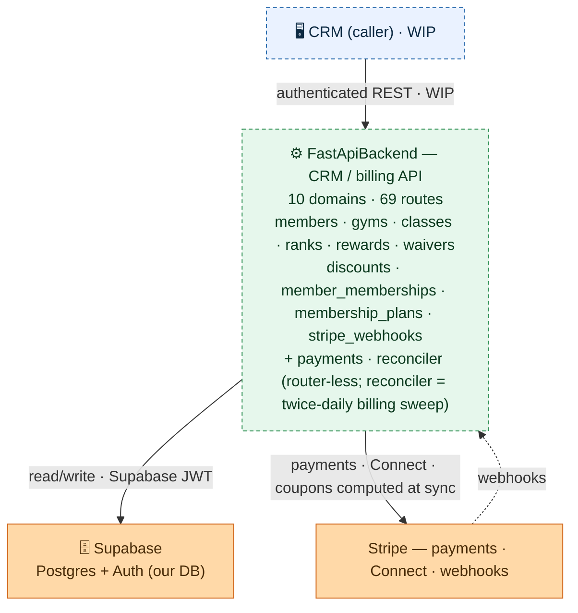

# FastApiBackend — CombatDen API

The membership + billing backend for CombatDen: a Python/FastAPI service that the **CRM** calls to
manage gyms, members, classes, ranks, rewards, and Stripe-backed billing. It owns no UI — it is a
read/write REST API over the shared Supabase Postgres, authenticated with Supabase JWTs.

> **Status: WIP, not yet deployed** (prod target `api.combatden.net`). The CRM is its first client
> and is still being wired up. See `../README.md` for where this sits in the whole system, and
> `CLAUDE.md` here for coding standards.

---

## Architecture (overview)



The CRM calls this API; it reads/writes the shared **Supabase** Postgres (auth via Supabase JWT) and
talks to **Stripe** for payments, Connect onboarding, and inbound webhooks. Dashed = WIP / inbound.

**For the full internal graph** — every route, the service classes, the grouped **Payments** Stripe
core, the cross-cutting **`PaymentSyncService`** (the declarative reconciler called by three domains —
it re-derives each family's desired Stripe state from the DB and converges Stripe onto it), and the
shared **`BillingParentResolver`** — see
**[`architecture.mermaid`](architecture.mermaid)** (generated from the DI wiring; render it with the
`mermaid-creation` skill).

**For the payment-sync engine in depth** — the step-by-step orchestration flow of
`update_payments_recurring` (resolve → freeze re-apply → settle once → build + resolve coupons →
execute → write back, returning `None`), plus the `preview` / `bulk` / deferred-reconciler branches —
see
**[`payment_sync.mermaid`](payment_sync.mermaid)**. The sync steps are grouped in one box with
**Supabase** + **Stripe** as outside actors and box-level edges (same convention as
`architecture.mermaid`). Green = the engine's steps / entry points, orange = the external actors;
solid = a live runtime call, dashed = future / shared-code. Deep engine knowledge lives in the
`sync-guide` skill.

---

## How a request flows

1. **`main.py` bootstraps the app** — `create_app()` builds the `dependency-injector` container, applies CORS, mounts every domain router, and (on shutdown) disposes the async DB pool. `GET /health` is unauthenticated.
2. **A router handles the route** under `/api/v1/<domain>`. Every protected route takes `HTTPBearer` credentials, and an injected `Auth` (`shared/auth.py`) verifies the **Supabase JWT** against the project JWKS.
3. **The router calls a DI-injected service** (`Depends(Provide[DependencyInjector.<service>])`). Services hold the business logic; the **`payments` package is a router-less Stripe core** injected into the billing domains rather than mounted.
4. **Services run domain SQL** from `<domain>/sql/*.sql` (never inline — see conventions) over the **async SQLAlchemy + asyncpg** session from `shared/database.py`, guarded by `column_guard` for immutable columns.
5. **External calls** go to **Stripe** (payments, Connect onboarding, and inbound webhooks landing on `POST /api/v1/stripe/webhooks`) and **Supabase** (Postgres data + Auth JWKS).

## Domains

Each domain is a vertical slice — `router/ + schema/ + service/ + sql/` — under `src/<domain>/`. The full chart lists each one's routes and services; this is what each is *for*:

| Domain | What it does |
|---|---|
| `members` | Member records + management + billing detail (profile, card, Stripe customer, invoices) |
| `classes` | Gated class check-in (plan eligibility + capacity + auto-end) + attendance streaks + per-cycle class usage (feeds member billing detail) |
| `gyms` | Gym records + Stripe **Connect** Express onboarding |
| `ranks` | Rank tiers / point thresholds + presets |
| `rewards` | Reward catalog + redemptions |
| `waivers` | Versioned waiver documents (plain gym config) + read-only e-sign signature tracking (per-waiver roster + per-member status) |
| `discounts` | Coupon-free discount presets (plain gym config; coupons computed at sync, not on the preset) |
| `member_memberships` | Member ↔ plan subscriptions: freeze/unfreeze, price changes, apply/remove discounts (add/remove immutable applied-discount snapshots; coupons computed + written back at sync), previews, cash/card charge, link/unlink family accounts (pure DB change) |
| `membership_plans` | Plan + price templates (Stripe products / prices) + migration |
| `stripe_webhooks` | Ingests Stripe webhook events and syncs billing state to the DB (invoices, charges, refunds, and `customer.subscription.deleted` → cancellation absorbed into the CRM) |
| `payments` *(no router)* | Stripe service core (client, payment, price, members, membership, subscription, discount) injected into the billing domains |
| `reconciler` *(no router)* | Twice-daily billing safety-net sweep (APScheduler in the lifespan, behind a global `resource_locks` lock): invoice-fetch backfill, Stripe→CRM cancellation absorption, `not_added` orphan cleanup, and the CRM→Stripe push (`bulk_payment_sync`). See the `sync-guide` skill |

## Conventions (the load-bearing rules)

- **No inline SQL.** Every query is a `.sql` file under `<domain>/sql/`, read at use.
- **Auth is Supabase JWT, not custom.** `shared/auth.py` validates tokens via the Supabase JWKS; routes depend on it through DI. Don't roll your own auth.
- **Dependency injection via `dependency-injector`.** `core/dependencies.py` is the container that wires every service + `Auth` + the DB pool; routers receive them through `Provide[...]`. (`architecture.mermaid` is generated from this wiring.)
- **Reuse Database enums/schemas.** `shared/db_schema_path.py` puts `../Database/python_data/schema` on `sys.path`; import enums with `from schema.<module> import <Enum>` instead of redefining them.
- **`openapi.json` is the contract.** The app's schema is dumped to `../Database/openapi.json`; clients (the CRM, seed scripts, tests) build against it — read the `required` fields before calling an endpoint.
- **Stripe-gated tables are `service_role`-write-only** (enforced by RLS in `../Database`); those writes go through this backend, never the `authenticated` client.

See `CLAUDE.md` in this directory for the full coding standards.

## Run (dev)

```bash
poetry install
cp .env.example .env          # fill Supabase + Stripe + DATABASE_URL
poetry run uvicorn src.main:app --reload   # docs at /docs when APP_DEBUG=true
```

## Cross-system

- **Caller:** the **CRM** (`../CRM`) — authenticated `dio` client, **WIP**.
- **Data:** the shared **Supabase Postgres** (read/write) + the **`../Database`** package (enum mirrors + `openapi.json`).
- **External:** **Stripe** (payments, Connect, webhooks) and **Supabase Auth** (JWT/JWKS).
