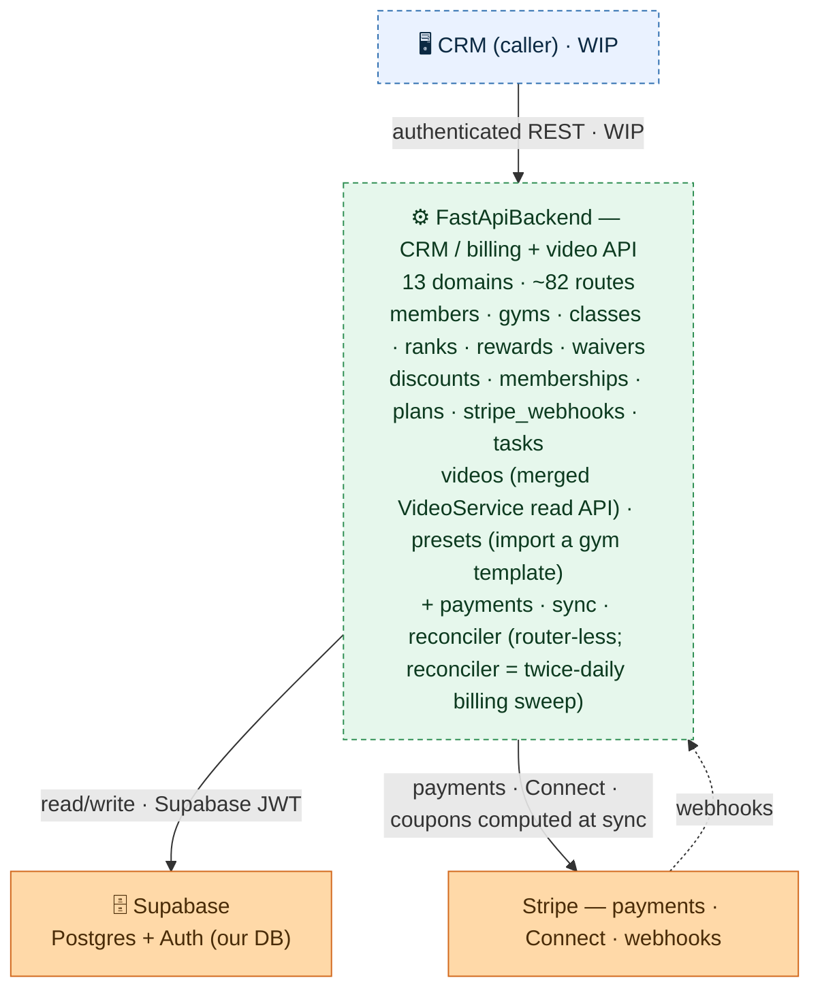

# FastApiBackend — CombatDen API

The membership + billing backend for CombatDen: a Python/FastAPI service that the **CRM** calls to
manage gyms, members, classes, ranks, rewards, Stripe-backed billing, and gym **video content** (the
merged VideoService read API + the gym-template preset import). It owns no UI — it is a read/write
REST API over the shared Supabase Postgres, authenticated with Supabase JWTs.

> **Status: WIP, not yet deployed** (prod target `api.combatden.net`). The CRM is its first client
> and is still being wired up. See `../README.md` for where this sits in the whole system, and
> `CLAUDE.md` here for coding standards.

---

## Architecture (overview)



The CRM calls this API; it reads/writes the shared **Supabase** Postgres (auth via Supabase JWT) and
talks to **Stripe** for payments, Connect onboarding, and inbound webhooks. Dashed = WIP / inbound.

**For the full internal graph** — every route, the service classes, the grouped **Payments** Stripe
core, the cross-cutting **`PaymentSyncService`** (the declarative reconciler called by three domains —
it re-derives each payer's desired Stripe state from the DB and converges Stripe onto it), and the
shared **`PayerResolver`** — see
**[`architecture.mermaid`](architecture.mermaid)** (generated from the DI wiring; render it with the
`mermaid-creation` skill).

**For the payment-sync engine in depth** — the step-by-step orchestration flow of
`update_payments_recurring` (resolve → build + resolve coupons (freeze = a 100%-off line) →
execute → write back, returning `None`), plus the `preview` / `bulk` / deferred-reconciler branches —
see
**[`payment_sync.mermaid`](payment_sync.mermaid)**. The sync steps are grouped in one box with
**Supabase** + **Stripe** as outside actors and box-level edges (same convention as
`architecture.mermaid`). Green = the engine's steps / entry points, orange = the external actors;
solid = a live runtime call, dashed = future / shared-code. Deep engine knowledge lives in the
`sync-guide` skill.

**For the scheduled reconciler in depth** — the twice-daily sweep flow (scheduler → invoice-fetch → orphan-clean → push, whose sync self-heals a gone subscription, → subscription-orphans, which cancels live Stripe subs with no live DB link), and the webhook `record` seam — see **[`reconciler.mermaid`](reconciler.mermaid)** (owned by the `reconciler-guide` skill).

**Invoice absorption fast path:** right after any invoice-creating membership op (`charge_card`, `start`, `upgrade`, prorating reprice, `mark-paid-cash`), a **deterministic post-op invoice fetch** fires fire-and-forget — it pulls that payer's new invoices from Stripe immediately and applies them via the same idempotent webhook `record()` seams, without waiting for the `invoice.paid` / `invoice_payment.paid` webhooks. Webhooks + the twice-daily reconciler sweep remain backstops. See `memberships-guide`.

---

## How a request flows

1. **`main.py` bootstraps the app** — `create_app()` builds the `dependency-injector` container, applies CORS, mounts every domain router, and (on shutdown) disposes the async DB pool. `GET /health` is unauthenticated.
2. **A router handles the route** under `/api/v1/<domain>`. Every protected route takes `HTTPBearer` credentials, and an injected `Auth` (`shared/auth.py`) verifies the **Supabase JWT** against the project JWKS.
3. **The router calls a DI-injected service** (`Depends(Provide[DependencyInjector.<service>])`). Services hold the business logic; the **`payments` package is a router-less Stripe core** injected into the billing domains rather than mounted.
4. **Services run domain SQL** from `<domain>/sql/*.sql` (never inline — see conventions) over the **async SQLAlchemy + asyncpg** session from `shared/database.py`, guarded by `column_guard` for immutable columns.
5. **External calls** go to **Stripe** (payments, Connect onboarding, and inbound webhooks landing on `POST /api/v1/stripe/webhooks`) and **Supabase** (Postgres data + Auth JWKS).

## Domains

Each domain is a vertical slice — `router/ + schema/ + service/ + sql/` — under `src/<domain>/`. The full chart lists each one's routes and services; this is what each is *for*:

| Domain | What it does |
|---|---|
| `members` | Member records + management + billing detail (profile, card, Stripe customer, invoices); **payer authorization**: `PUT /{member_id}/link` authorizes a payer (signs the gym's default authorized-payer waiver atomically; many-to-many `member_authorized_payers`), `POST /link/remove` cascades-cancel then de-authorizes (the only unlink path — de-authorizing without cancelling would orphan billing), `GET /{member_id}/authorized-payer-waiver` fetches the waiver to display before signing |
| `classes` | Gated class check-in (plan eligibility + capacity + auto-end) + attendance streaks + per-cycle class usage (feeds member billing detail) |
| `gyms` | Gym records + Stripe **Connect** Express onboarding |
| `ranks` | Rank tiers / point thresholds + presets |
| `rewards` | Reward catalog + redemptions |
| `waivers` | Versioned waiver documents (plain gym config) + read-only e-sign signature tracking (per-waiver roster + per-member status); `WaiversService` is also injected into `MemberMembershipsLinked` to record the payer's signature when authorizing a payer |
| `discounts` | Coupon-free discount presets (plain gym config; coupons computed at sync, not on the preset) |
| `memberships` | Member ↔ plan subscriptions: one list-based **start** (a payer's family in one call, discounts applied at creation, an optional `payment` card entered at checkout — a one-off for the one-time invoice, or saved as the default FIRST via members-management so recurring bills it; the default-save aborts the whole start if it fails — ≤2 charges — one consolidated one-time invoice + one recurring converge — per-membership breakdown out), freeze/unfreeze, **reprice** (membership rows are append-only — `price_id`/`stripe_item_id` immutable, so a reprice cancels the old row + inserts a successor: `PUT /price` upgrades ONE member directly/synchronously, `POST /reprice-plan` batch-upgrades every member on a plan to its active price as a tracked task the CRM polls via `/tasks`), apply/remove discounts (add/remove immutable applied-discount rows; coupons computed + written back at sync; one-time/trial = creation-only), previews (start = 3-way `one_time / due_now / recurring`), cash/card charge, **refund** a prior charge (card → Stripe refund + record; cash → record only — standalone, mirrors charge-card); payer authorization via `MemberMembershipsLinked` — `member_authorized_payers` many-to-many, **waiver-gated** (signing the gym's default authorized-payer waiver is required and written atomically with the authorization row) |
| `plans` | Plan + price templates (Stripe products / prices); moving members to a new price is the per-plan reprice (in `memberships`, `POST /reprice-plan`) |
| `stripe_webhooks` | Ingests Stripe webhook events and syncs billing state to the DB (invoices, charges, refunds, and `customer.subscription.deleted` → triggers a family sync that cancels the gone subscription in the CRM) |
| `tasks` | Tracked background operations (`tasks` + `task_items` tables): an op endpoint creates a task and returns its id immediately; the executor claims items atomically, dispatches to the task_type's registered handler (e.g. `membership_reprice`), and retries ×3. Crash recovery lives in the **reconciler** — its twice-daily sweep re-runs unfinished tasks (the tasks domain has no scheduler of its own). Read-only polling routes (`GET /tasks/ongoing`, `GET /tasks/{id}`); item-targeted membership ops reject mid-task rows (409) |
| `videos` | The merged **VideoService read API**: a **public** slug-keyed template catalog (`/api/v1/videos/templates*` — the 76 `video_gym*` demo templates: cards, detail, feed, preview) plus a real gym's authed live content keyed by UUID (`/api/v1/gyms/{id}/videos`, `/videos/preview`, `/videos/spec`, `/showcase` — the latter assembles `gym_video_spec` + `gym_classes ⋈ gym_employees` + `gym_rewards`). Read-only; the shared `video` pool + templates are written by the separate VideoService batch job |
| `presets` | Import a gym-type template into a gym's **real** production tables in one transaction (`POST /api/v1/gyms/{id}/presets/import`): copies the template's videos/spec/queries + real `gym_classes` (synthesized schedule defaults) + instructors as `gym_employees` + `gym_rewards` + `gyms.theme_design_id`. FK-safe overwrite (soft-delete classes, deactivate rewards, upsert trainers). Owner + email-allowlist gated (`preset_import_allowed_emails`, demo: owner1) |
| `sync` *(no router)* | Payment-sync engine: re-derives the family's desired Stripe subscription state from the DB on every membership mutation and converges Stripe onto it. Also owns the one-time invoice charge path. |
| `payments` *(no router)* | Stripe service core (client, payment, price, members, membership, subscription, discount) injected into the billing domains |
| `reconciler` *(no router)* | Twice-daily billing safety-net sweep (APScheduler in the lifespan): invoice-fetch backfill (delegates per gym to `MemberMembershipsInvoiceFetch.sweep_account` in `memberships` — the reconciler calls in, never the reverse), stale-task recovery (re-runs unfinished `tasks` whose in-process run died), `not_added` orphan cleanup, the CRM→Stripe push (`bulk_payment_sync`, whose sync self-heals a gone subscription), and the subscription-orphan sweep (cancel live Stripe subs with no live DB link). See the `reconciler-guide` skill |

## Conventions (the load-bearing rules)

- **No inline SQL.** Every query is a `.sql` file under `<domain>/sql/`, read at use.
- **Auth is Supabase JWT, not custom.** `shared/auth.py` validates tokens via the Supabase JWKS; routes depend on it through DI. Don't roll your own auth.
- **Dependency injection via `dependency-injector`.** `core/dependencies.py` is the container that wires every service + `Auth` + the DB pool; routers receive them through `Provide[...]`. (`architecture.mermaid` is generated from this wiring.)
- **Reuse Database enums/schemas.** `shared/db_schema_path.py` puts `../Database/python_data/schema` on `sys.path`; import enums with `from schema.<module> import <Enum>` instead of redefining them.
- **The Pydantic schemas are the contract.** Clients (the CRM, seed scripts, tests) build against `src/<domain>/<domain>_schema.py` — read the `required` fields there before calling an endpoint. `../Database/openapi.json` is an optional gitignored local dump (never committed; regenerate with `curl localhost:8000/openapi.json` when useful).
- **Stripe-gated tables are `service_role`-write-only** (enforced by RLS in `../Database`); those writes go through this backend, never the `authenticated` client.

See `CLAUDE.md` in this directory for the full coding standards.

## Run (dev)

```bash
poetry install
cp .env.example .env          # fill Supabase + Stripe + DATABASE_URL
poetry run uvicorn src.main:app --reload   # docs at /docs when APP_DEBUG=true
```

## Cross-system

- **Caller:** the **CRM** (`../CRM`) — authenticated `dio` client, **WIP**.
- **Data:** the shared **Supabase Postgres** (read/write) + the **`../Database`** package (enum mirrors in `python_data/schema/`).
- **External:** **Stripe** (payments, Connect, webhooks) and **Supabase Auth** (JWT/JWKS).
