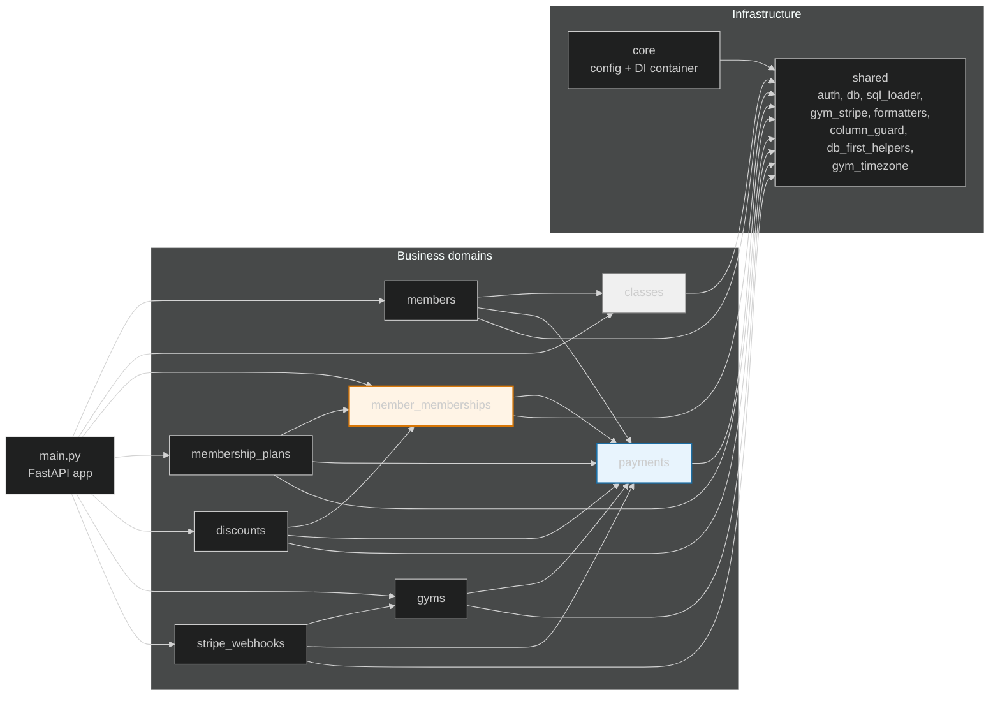
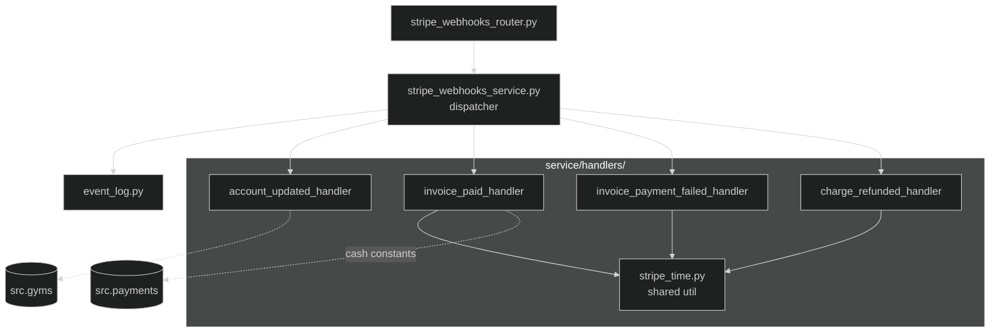

# FastAPI Backend — Module Dependency Graph

A visual map of `src/` for reasoning about coupling. Use this to spot:

- **Over-linkage** — a module imported by almost everything (candidate for splitting, or a sign it's doing too much)
- **Under-linkage** — a module that nothing imports (dead code, or a leaf that could be inlined)
- **Crossing the grain** — unexpected edges that violate the domain layering (e.g., a leaf handler reaching back into a facade)

All diagrams are **Mermaid**. They render natively in GitHub and in VS Code with the Markdown Preview Mermaid extension. For pan/zoom, paste any block into <https://mermaid.live> — or open the matching `.mmd` file next to this one (listed in each section).

> Edges are **real Python imports** (`from src.X...`), not conceptual. Generated from a structural scan on 2026-04-15 — regenerate manually if the layout drifts.

## How to read this

- A **solid arrow** `A --> B` means "A imports from B".
- A **dashed arrow** `A -.-> B` means a cross-domain edge leaving the subgraph (shown in the per-module diagrams to avoid clutter).
- **Subgraphs** (boxes) group files that live in the same directory. In the big-module diagrams, each sub-package is its own subgraph.
- A module with **no incoming edges** is either an entry point (router) or unused. A module with **many incoming edges** is a shared utility — check that its responsibilities are still cohesive.

## Companion `.mmd` files

For easy copy-paste into a rendering engine, each diagram is also available as a standalone Mermaid file in this same directory:

| # | Diagram | Mermaid file |
|---|---------|--------------|
| 1 | Overview | [`module_graph_overview.mmd`](module_graph_overview.mmd) |
| 2 | `members/` | [`module_graph_members.mmd`](module_graph_members.mmd) |
| 3 | `payments/` | [`module_graph_payments.mmd`](module_graph_payments.mmd) |
| 4 | `member_memberships/` | [`module_graph_member_memberships.mmd`](module_graph_member_memberships.mmd) |
| 5 | `stripe_webhooks/` | [`module_graph_stripe_webhooks.mmd`](module_graph_stripe_webhooks.mmd) |

---

## 1. Overview — domain-to-domain

Every top-level folder in `src/` as a single node. Edges are cross-domain imports (`from src.<other_domain>`). Shared infrastructure (`core`, `shared`) is a separate subgraph to keep the domain layer readable.



**What to notice:**

- **`payments` is the sink** — nothing inside `src/payments` imports another domain. That's the right shape: Stripe access is a foundation, not a caller. If you ever find `from src.members` inside `payments/`, that's a layering violation.
- **`member_memberships` is a mid-tier hub** — it's imported by `discounts` and `membership_plans` (both link their own Stripe mutations through membership payment sync). Worth watching: if a third domain starts importing it, consider whether sync orchestration should move into its own module.
- **`classes` is isolated** — no outbound cross-domain edges. Only `members` imports it (for cycle counts and streaks). If `classes` grows new responsibilities that need member data, that could flip and introduce a cycle — worth watching.
- **`shared` is a gravity well** — every domain depends on it. That's fine for `auth`/`database`/`sql_loader`, but the file list is growing (`gym_stripe_service`, `db_first_helpers`, `column_guard`, `formatters`, `gym_timezone`). If any single shared file ends up pulled by >20 sites and covers multiple concerns, it's a splitting candidate.
- **No cycles** — this layering is a DAG right now. Preserve that.

---

## 2. `members/` — three parallel orchestration styles

The biggest domain by file count (28). The router fans out to four facades, each with a different internal pattern.

```mermaid
---
config:
  theme: dark
---
graph TB
    router[members_router.py]

    subgraph details["service/member_details/"]
        mds[member_details_service.py<br/>orchestrator]
        mds_cc[member_details_cycle_counts_bridge]
        mds_st[member_details_streak_bridge]
        mds_mg[member_details_membership_grouper]
        mds_sup[member_details_supplementary]
    end

    subgraph mgmt["service/management/"]
        mms[members_management_service.py<br/>facade]
        mms_base[members_management_base]
        mms_create[members_management_create]
        mms_update[members_management_update]
        mms_inv[members_management_invoices]
        mms_link[members_management_linked]
    end

    subgraph crm["service/crm_member_services/"]
        mcl[members_crm_members_list_service.py<br/>orchestrator]
        mcl_base[members_crm_base_service]
        mcl_all[members_crm_all_service]
        mcl_frozen[members_crm_frozen_service]
        mcl_overdue[members_crm_overdue_service]
        mcl_trial[members_crm_trial_service]
    end

    totals[members_crm_total_counts_service.py]

    router --> mds
    router --> mms
    router --> mcl
    router --> totals

    mds --> mds_cc
    mds --> mds_st
    mds --> mds_mg
    mds --> mds_sup
    mds_mg --> mds_sup

    mms --> mms_create
    mms --> mms_update
    mms --> mms_inv
    mms --> mms_link
    mms_create --> mms_base
    mms_update --> mms_base
    mms_inv --> mms_base
    mms_link --> mms_base

    mcl --> mcl_all
    mcl --> mcl_frozen
    mcl --> mcl_overdue
    mcl --> mcl_trial
    mcl_all --> mcl_base
    mcl_frozen --> mcl_base
    mcl_overdue --> mcl_base
    mcl_trial --> mcl_base

    mds_cc -.->|calls| classes_ext[(src.classes)]
    mds_st -.->|calls| classes_ext
    mms -.->|Stripe ops| payments_ext[(src.payments)]
```



**What to notice:**

- **Three parallel `_base` patterns** — `members_management_base`, `members_crm_base_service`, and (implicitly) the `member_details` bridges all play the "shared helpers for a family of sibling services" role but are named differently. If you want consistency, this is where to normalize.
- **`member_details` is the only fan-in beyond siblings** — `membership_grouper` → `supplementary` is a real internal edge, the only one that's not just "sibling → base". Worth a double-check that this is intentional, not a convenience import.
- **`totals` is a lone service** — not under any sub-package. Either promote it into `crm_member_services/` with the list, or leave it alone as a deliberately-isolated endpoint.
- **Member-details bridges are where the cross-domain coupling lives** — the `classes` dependency is localized to two bridge files, which is the right shape. If more `classes` imports appear elsewhere in `members/`, pull them through the bridges.

---

## 3. `payments/` — subscription facade over flat Stripe services

```mermaid
---
config:
  theme: dark
---
graph TB
    subgraph base["service/ (Stripe clients)"]
        client[payments_stripe_client.py]
        mappers[payments_stripe_mappers.py]
        cash[cash_constants.py]
        price[payments_stripe_price_service]
        members[payments_stripe_members_service]
        discount[payments_stripe_discount_service]
        membership[payments_stripe_membership_service]
        payment[payments_stripe_payment_service]
    end

    subgraph sub["service/subscription/"]
        facade[payments_subscription_facade.py<br/>orchestrator]
        sub_base[payments_subscription_base]
        sub_cancel[payments_subscription_cancel]
        sub_create[payments_subscription_create]
        sub_freeze[payments_subscription_freeze]
        sub_item[payments_subscription_item]
        sub_migration[payments_subscription_migration]
        sub_update[payments_subscription_update]
        sub_upcoming[payments_subscription_upcoming]
    end

    price --> client
    members --> client
    discount --> client
    membership --> client
    membership --> price
    payment --> client
    payment --> mappers
    payment --> members
    payment --> price
    payment --> cash

    sub_base --> client
    sub_base --> discount
    sub_base --> members
    sub_base --> price

    sub_cancel --> sub_base
    sub_freeze --> sub_base
    sub_item --> sub_base
    sub_migration --> sub_base
    sub_upcoming --> sub_base
    sub_upcoming --> mappers
    sub_update --> sub_base
    sub_update --> mappers
    sub_create --> sub_base
    sub_create --> mappers
    sub_create --> cash

    facade --> client
    facade --> discount
    facade --> members
    facade --> price
    facade --> sub_cancel
    facade --> sub_create
    facade --> sub_freeze
    facade --> sub_item
    facade --> sub_migration
    facade --> sub_update
    facade --> sub_upcoming
```



**What to notice:**

- **`payments_stripe_client` is the foundation** — every service imports it. Good, that's the intended shape.
- **`subscription_facade` is the orchestrator**, and it legitimately imports everything under `subscription/`. This is the fan-out pattern: 7 operations + 4 base services. Large but cohesive.
- **`payments_stripe_payment_service` has the densest fan-in from base services** — it pulls in client, mappers, members, price, and cash_constants. If it grows further, consider whether invoice-preview formatting should move into `mappers`.
- **`membership_service` is underused internally** — only imports `client` and `price`. Check whether it's actually called from outside `payments` (it is — via DI). No action, just be aware it's a thin layer.
- **There is no `subscription/__init__` re-export logic here**; the facade is the single entry point. Don't add shortcut imports that bypass it.

---

## 4. `member_memberships/` — hub for payment sync

```mermaid
---
config:
  theme: dark
---
graph TB
    router[member_memberships_router.py]

    subgraph memberships["service/memberships/ (lifecycle ops)"]
        mm_svc[member_memberships_service.py<br/>facade]
        mm_base[member_memberships_base]
        mm_cancel[member_memberships_cancel]
        mm_freeze[member_memberships_freeze]
        mm_start[member_memberships_start]
        mm_update[member_memberships_update_price]
        mm_cash[member_memberships_mark_paid_cash]
    end

    subgraph sync["service/payment_sync/"]
        sync_svc[membership_payment_sync_service.py<br/>hub]
        sync_builder[payment_sync_builder]
        sync_alloc[payment_sync_discount_allocator]
        sync_queries[payment_sync_queries]
        sync_stripe[payment_sync_stripe]
        sync_wb[price_writeback]
    end

    linked[linked_member_discount_service.py]

    router --> mm_svc
    mm_svc --> mm_cancel
    mm_svc --> mm_freeze
    mm_svc --> mm_start
    mm_svc --> mm_update
    mm_svc --> mm_cash
    mm_cancel --> mm_base
    mm_freeze --> mm_base
    mm_start --> mm_base
    mm_update --> mm_base
    mm_cash --> mm_base

    sync_svc --> sync_builder
    sync_svc --> sync_alloc
    sync_svc --> sync_queries
    sync_svc --> sync_stripe
    sync_svc --> sync_wb
    sync_svc --> linked

    sync_svc -.->|called by| discounts_ext[(src.discounts)]
    sync_svc -.->|called by| plans_ext[(src.membership_plans)]
    mm_start -.->|Stripe ops| payments_ext[(src.payments)]
```



**What to notice:**

- **Two cleanly independent sub-trees.** `member_memberships_service` (lifecycle) and `membership_payment_sync_service` (sync) share nothing. Lifecycle ops reach sync state exclusively by calling `sync_svc.update_payments_recurring(...)`; `price_writeback` is now a pure leaf owned by `sync_svc`, invoked automatically at the end of every recurring mutation. Lifecycle ops no longer need to know it exists.
- **`sync_svc` is the external entry point from `discounts` and `membership_plans`** — this is the edge that makes `member_memberships` a mid-tier hub in the overview. If you ever add a third external caller, reconsider whether sync orchestration should live in its own top-level domain.
- **`linked_member_discount_service` is the odd one out** — it's not in a sub-package and is only imported by `sync_svc`. Candidate for moving inside `payment_sync/` for consistency.
- **`mm_start` is the only lifecycle op with a direct `payments` edge** — the one-time-charge path (non-recurring plans) calls the Stripe payment service directly. All recurring mutations go through `sync_svc`.

---

## 5. `stripe_webhooks/` — dispatcher + handlers



**What to notice:**

- **Textbook dispatcher pattern.** Router → dispatcher → one handler per event type. No handler calls another handler. Leaving it alone is the right move.
- **`stripe_time` is a leaf util** shared by 3 of 4 handlers. `account_updated_handler` doesn't need it — no action.
- **Handlers are almost fully self-contained.** `invoice_payment_failed_handler` and `charge_refunded_handler` have zero cross-domain imports — they write directly to the DB via SQL. `invoice_paid_handler`'s only `src.payments` edge is a constants import (`cash_constants.py`) to detect out-of-band cash payments — not a real service dependency. Only `account_updated_handler` has a substantive cross-domain edge, into `src.gyms`.
- **`event_log` is only called by the dispatcher** — correct, don't let handlers log events directly.

---

## Maintenance

This file is hand-authored. When you add a new domain under `src/`, add it to **Diagram 1** and decide whether it's big enough to need its own subgraph. When you add a new file inside an expanded module (members, payments, member_memberships, stripe_webhooks), update the corresponding diagram **and** the matching `.mmd` file.

Quick sanity check you can run after edits:

```bash
# Cross-domain import matrix — should match the overview edges
for d in members classes payments member_memberships discounts membership_plans gyms stripe_webhooks; do
  echo "=== $d ==="
  grep -rhE "^from src\.(members|classes|payments|member_memberships|discounts|membership_plans|gyms|stripe_webhooks)" src/$d 2>/dev/null \
    | grep -v "from src\.$d" \
    | sed -E 's/from src\.([a-z_]+).*/  -> \1/' \
    | sort -u
done
```

If the output doesn't match **Diagram 1**, the diagram is stale.
