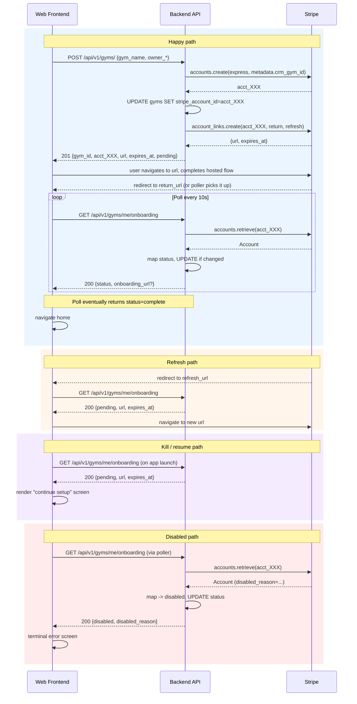

# Flow overview

Gym creation is a three-step dance between the web frontend, the
backend, and Stripe's Connect Express hosted onboarding flow. A
single user, a single gym, and exactly one Stripe connected
account are in play. There is no OAuth, no intermediate token,
and no persistent session beyond the Supabase JWT the app
already has.

## Vocabulary

- **Connect Express account**: A Stripe-hosted bank-account /
  identity / tax-info collection flow for the gym's owner. The
  backend mints this on the user's behalf on `POST /api/v1/gyms/`.
- **Hosted onboarding URL** (a.k.a. AccountLink): A short-lived
  Stripe URL (~5 minutes) that opens the Express flow. The
  backend returns this from `POST /api/v1/gyms/`,
  `GET /api/v1/gyms/me/onboarding`, and
  `POST /api/v1/gyms/me/onboarding/link`. Single-use in practice
  — once the user opens it, treat it as consumed.
- **`stripe_onboarding_status`**: The canonical state of the
  gym's Stripe account as far as the backend is concerned.
  Values: `pending`, `complete`, `disabled`. (A fourth value,
  `not_started`, exists in the database but is only ever seen
  before a Stripe account has been attached — the frontend will
  never receive it from these endpoints.)
- **`return_url`**: The URL Stripe redirects to on successful
  completion of the hosted flow. Configured on the backend and
  pointed at a frontend route like `/gym-setup/return`.
- **`refresh_url`**: The URL Stripe redirects to if the hosted
  link expires or the user bails. Pointed at a frontend route
  like `/gym-setup/refresh`.

Both return/refresh routes are plain browser navigations in a
web app — they do not need any special handling beyond rendering
a "checking status..." page while the poller catches up.

## Happy path

1. User fills the wizard form (`gym_name`, `owner_first_name`,
   `owner_last_name`) and submits.
2. Frontend calls `POST /api/v1/gyms/`. Backend:
   - creates the gym + owner rows (invisible to direct Supabase
     reads until Stripe is attached),
   - calls `stripe.Account.create(type="express", ...)` with an
     idempotency key so a network-blipped retry can't mint two
     accounts,
   - attaches the Stripe account id to the gym row,
   - calls `stripe.AccountLink.create(...)` for a hosted URL.
3. Backend returns `201` with `onboarding_url` + `expires_at`.
4. Frontend navigates the user to the hosted URL. Two reasonable
   options — either works, pick one:
   - **Full-page redirect:** `window.location.href = onboarding_url`.
     The user fills in identity / bank info on Stripe, finishes,
     and Stripe redirects back to `return_url` — which is a
     route on your frontend that renders a "verifying..." page.
     That page starts the poller.
   - **New tab + status page:** open the URL via `window.open(...)`,
     keep the main tab on a "finishing Stripe setup..." page
     that runs the poller from the moment the tab opens. When
     Stripe eventually flips `complete`, the poller sees it.
5. Either way, the poller calls `GET /api/v1/gyms/me/onboarding`
   every ~10s. When it returns `status=complete`, navigate to
   the home screen.

## Refresh path (link expired / user bailed)

Happens when the user opens the hosted URL but does not complete
it within ~5 minutes, or bails out of the flow. Stripe redirects
them to `refresh_url` instead of `return_url`.

In the polling model, this is trivial: the `/gym-setup/refresh`
route just shows "restarting Stripe setup..." and calls
`GET /api/v1/gyms/me/onboarding`. That response returns
`status=pending` plus a fresh `onboarding_url`, which the
frontend then navigates to (full redirect or new tab — same
choice as step 4 above).

You can also use `POST /api/v1/gyms/me/onboarding/link` for this
if you want to skip the Stripe Account retrieve. In a polling
model it's usually simpler to just call `GET /me/onboarding` and
let it do both jobs at once.

## Kill / resume path (user closed the tab mid-onboarding)

1. User finishes the wizard, gets redirected to Stripe, closes
   the tab without completing.
2. Later, they log back in. The home screen bootstrap calls
   `GET /api/v1/gyms/me/onboarding`.
3. Backend returns `status=pending` plus a fresh `onboarding_url`.
4. Frontend routes to a "continue setup" screen that offers a
   button to re-open the hosted URL, then starts polling again.

The backend has no notion of an abandoned session — the gym row
just sits in `pending` state until the user comes back and
finishes, or an operator nukes it manually.

## Disabled path

Rare but real — Stripe can flip an account to `disabled` for
compliance reasons (identity mismatch, prohibited business,
etc).

1. Poller calls `GET /api/v1/gyms/me/onboarding` as normal.
2. Backend retrieves the Stripe account, sees a
   `requirements.disabled_reason`, maps to `disabled`, writes
   the status, and returns `disabled` + the `disabled_reason`
   string passed through verbatim.
3. Frontend routes to a terminal error screen: "Your Stripe
   account is disabled. Contact support." Include the
   `disabled_reason` string as-is for the support channel.

There is no in-app remediation. The gym owner must contact
support, who will reach out to Stripe.

## Sequence diagram

## Why the backend controls all of this

Three reasons, in order of importance:

1. **RLS.** The `authenticated` role no longer has INSERT/UPDATE
   on `gyms` or `gym_employees`. The service role does, and only
   the backend has the service role.
2. **Orphan prevention.** The backend's create flow is DB-first:
   insert a hidden row, call Stripe, UPDATE the row with the
   account id (with retries + backoff). If something goes wrong
   after Stripe succeeds, the backend raises a loud error and
   logs the orphaned Stripe id so support can reconcile. This is
   impossible to get right from a thin client.
3. **Webhook sync.** Stripe fires `account.updated` on every
   state change, and the backend has a handler for it that
   writes the same column the refresh endpoint writes. So the
   DB is eventually correct even if the frontend never polls —
   polling is just the user-facing "tell me now" path.

## What Stripe guarantees you

- The hosted flow may take the user anywhere from 30 seconds to
  20 minutes. Do not put a timer on the UI waiting for them.
- `return_url` fires on successful completion; `refresh_url`
  fires on expiry or bail. Both are normal browser redirects.
- `account.updated` webhooks arrive within seconds of any state
  change, and Stripe retries delivery for 72 hours on failure.

## What Stripe does NOT guarantee

- `details_submitted=true` does not imply `charges_enabled=true`
  or `payouts_enabled=true`. Stripe may still be verifying.
  Only trust the backend's mapped `stripe_onboarding_status`.
- A hosted URL is valid for ~5 minutes. Always check
  `onboarding_url_expires_at` before opening. If it is in the
  past, re-fetch via `GET /me/onboarding` first.
- The user may never come back from the hosted flow. Your poller
  should stop once the tab is hidden long enough (see
  `03_polling.md`) so you don't hammer the backend for a user
  who closed the laptop.
