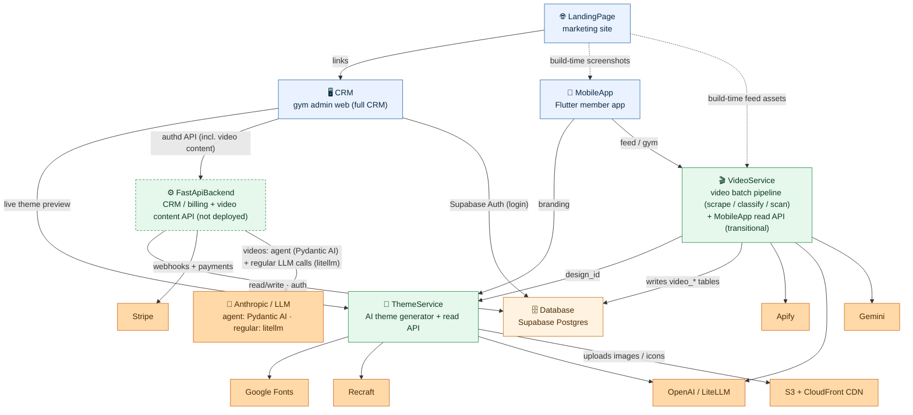

# CombatDen — System Map

CombatDen is a **white-label engagement platform for combat-sports gyms**: a member app, a
gym-owner admin **CRM**, a marketing site, an AI theme generator, a curated video pipeline, a
membership/billing backend, and one shared Supabase database underneath all of it.

This repo is a **monorepo of 7 independent systems**. The graph below is the **high-level map** —
the systems and how they wire into each other. For the full picture (every system opened up to its
inner nodes, the two engines split into their creation vs read-API halves, skills/scripts), see
**[`architecture.mermaid`](architecture.mermaid)**.

---

## The big graph

### Legend

- **Top-down = data/request flow.** Client apps up top, the backend services in the middle, the shared Database and external third-party services at the bottom.
- **Colors:** blue = client apps · green = backend services / engines · **orange = the shared Database and all external third-party services**.
- **Dashed box border = built but not yet deployed.** The CRM has been **restored to a full gym-admin CRM** — Supabase-auth login, members list + member detail, gym setup, and the Stripe billing surface are built natively and wired to the FastApiBackend over an authenticated `dio` client; its ThemeService read stays live. The **FastApiBackend** that backs it is built (members/gyms/classes/ranks/rewards + memberships/plans/discounts/payments/webhooks + the merged `videos` + `presets` domains) but has **no prod host yet** (`api.combatden.net` pending). Billing's failed-payment / dunning / refund edge handling is now covered by the Stripe webhooks + a twice-daily reconciler sweep (a few optimizations still deferred). **VideoService** is the video batch pipeline (scrape/classify/scan) that owns the shared `video_*` pool; the CRM reads video content via FastApiBackend, while MobileApp still reads VideoService directly (transitional).
- **Solid arrow = a live runtime dependency** (HTTP, DB read/write, third-party API). **Dashed arrow = build-time or operational** — e.g. LandingPage capturing screenshots/feed assets at build time.
- **Every arrow connects siblings** — at this level, system → system or system → external service.
- **Want the inner workings?** `architecture.mermaid` opens every box up: the API vs creation split for ThemeService/VideoService, the pipeline steps, and the skills/scripts that operate each engine. Render it with the `mermaid-creation` skill (`npx @mermaid-js/mermaid-cli -i architecture.mermaid -o architecture.svg`).

---

## The 7 systems

**📱 MobileApp** — Flutter member-facing app (the product members would use). Live features: a paginated video feed and gym detail (classes + rewards) from VideoService; the rest (home, booking, profile) is a high-fidelity prototype. Branding is resolved at runtime through the shared `theme_flutter` package. *Talks to:* VideoService (feed/gym — transitional direct read), ThemeService (branding).

**🖥️ CRM** — Flutter **web** gym-owner admin app (formerly AppManagement). The **full CRM**, restored from the old FlutterCRM and rebuilt natively in AppManagement's design: a **Supabase-auth** login gate, **members list + member detail** (memberships, invoices, charges, discounts, linked accounts + their action dialogs), **gym setup** (Stripe Connect onboarding), and the **Stripe billing** surface — all built on BLoC + repositories calling **FastApiBackend** through an authenticated `dio` client (`lib/core/network/api_client.dart`, Supabase-JWT interceptor). Video content (gym feed, spec) is served by **FastApiBackend** via the `videos` domain; the gym showcase (branded class/reward cards) is served via the `theme` domain. The **ThemeService** live theme preview (via `theme_flutter`) stays live and also ships as the standalone public **theme browser** at `themes.combatden.net`. Billing's failed-payment / dunning edge cases are now covered by webhooks + a twice-daily reconciler sweep (a few optimizations deferred) and the backend isn't deployed yet, so end-to-end runs against a local FastApiBackend. *Talks to:* FastApiBackend (auth'd — billing + video content), Supabase (auth), ThemeService (read-only branding). Deploys to `app.combatden.net` + `themes.combatden.net`.

**🌐 LandingPage** — Marketing site (React via CDN + Babel, no bundler) at `www.combatden.net`. Hero phone carousel, feed demo, loyalty loop, pricing. It makes no live API calls — its screenshots are captured from MobileApp and its feed thumbnails are pulled from VideoService **at build time**, then baked into the deploy. It links out to the theme browser. *Talks to:* CRM (link), MobileApp + VideoService (build-time assets only).

**⚙️ FastApiBackend** — Python/FastAPI membership + billing + video content backend (the CRM's API). Routers for members, gyms, classes, ranks, rewards, plus the billing subsystem — membership plans, discounts, member memberships, payments, and Stripe webhooks — and three video domains: **`videos`** (authed real-gym feed + LLM spec/agent authoring surface — `VideoSpecService`, `VideoQueryGenerator`, `VideoSpecAuthoring`, `VideoFeedRefiner` as standalone general services using **litellm** (`LiteLLMClient`) for structured calls, plus `VideoAgentService` as a thin **Pydantic AI** conversational agent wrapper; one-way layering: agent → `VideosService` facade → services), **`presets`** (public slug-keyed template catalog via `PresetsTemplateService` + owner-gated import of a template into a gym's live tables), and **`theme`** (gym showcase — branded class/reward cards via `ThemeShowcaseService`). A service/SQL layer; Supabase-JWT auth; Python 3.13. The request/response contract lives in the backend's Pydantic schemas (`src/<domain>/<domain>_schema.py`). *Talks to:* Database (read/write + Supabase Auth), Stripe (payments + webhooks), Anthropic/LLM provider (video spec agent via Pydantic AI; query gen + feed refiner via litellm). **Built and wired to the CRM, not yet deployed** (prod target `api.combatden.net`); billing's failed-payment / dunning / refund edge handling is now covered by the Stripe webhooks + a twice-daily reconciler sweep (a few optimizations still deferred).

**🎬 VideoService** — owns the gym-video **batch pipeline**, and is now **two distinct parts**. The **CREATION pipeline** (driven by the `videoservice` skill — make-gym / scrape / scan — plus the `gym_maker`, `scraper`, `scan`, `sync_gyms`, `import_yaml`, `sql` scripts and the `VideoDbWriter`) scrapes YouTube via Apify, classifies with Gemini/LiteLLM, and **writes** the shared Postgres `video_*` tables. The **READ API** at `video.combatden.net` is a transitional source for the **MobileApp** only — the CRM reads video content via FastApiBackend's merged `videos` domain. The two halves never call each other — the database is the handoff.

**🎨 ThemeService** — the AI theme generator, also **two separate halves**. The **CREATION generator** (the `brand-brief` skill authors `customization.yaml`; the async-DAG orchestrator runs the color/font/image/icon/text/lottie modules; the `writer` emits `output.yaml`; the uploader pushes assets to the CDN — all operated by the `edit_theme` skill and the `regen`/`regen_image`/`edit_customization`/`expand`/`remove_bg`/`sync_assets`/`fetch_icon_sets` scripts) talks to Google Fonts, Recraft, OpenAI/LiteLLM, and AWS S3 + CloudFront. The **READ API** at `theme.combatden.net` (`/apps/{id}/styles`, plus the shared `ThemeFlutter` client package the apps import) only serves the produced `output.yaml`. Handoff is the artifact, not a call.

**🗄️ Database** — The shared **Supabase Postgres** that everything converges on. Holds `supabase/schemas/*.sql` (tables), `access_rules/*.sql` (RLS), and Python enum mirrors in `python_data/schema/`. Table domains: member, gym, rank/reward, membership + billing (Stripe-gated), class scheduling, and the `video_*` tables. *Consumed by:* FastApiBackend and VideoService directly; Supabase Auth also backs CRM login.

---

## How they connect (the load-bearing wiring)

- **CRM is wired to FastApiBackend for all content.** CRM authenticates with Supabase, then calls FastApiBackend over an authenticated `dio` client (`api_client.dart` + JWT interceptor). The members list/detail, gym-setup, billing screens, and video content (gym feed + spec via `videos` domain; gym showcase via `theme` domain; template catalog via `presets` domain) are all dispatched through BLoC → repositories → the API. The ThemeService live preview is the one remaining direct edge integration. The backend isn't deployed yet, so end-to-end runs against a local FastApiBackend on `:8000`.
- **One shared database is the hub.** FastApiBackend and VideoService both read/write the same Supabase Postgres. They stay consistent by importing enum mirrors from `Database/python_data/schema/` and honoring the backend's Pydantic schemas as the request/response contract.
- **Each engine's creation and read sides are decoupled by an artifact.** ThemeService-CREATION writes `output.yaml` (+ CDN assets) that ThemeService-API serves; VideoService-CREATION writes the `video_*` tables that FastApiBackend (`videos` domain) and VideoService-READ-API both read. No direct call crosses creation and read halves.
- **One shared Flutter package is the theming backbone.** `ThemeService/ThemeFlutter` is imported by **both** MobileApp and CRM (`../ThemeService/ThemeFlutter`) — it fetches and caches each tenant's branding and resolves colors/fonts/images at runtime.
- **VideoService points at ThemeService for branding.** Each gym's YAML stores a ThemeService `design_id`, so the curated feed and the visual theme line up per gym.
- **LandingPage is downstream of the apps at build time.** Its phone screenshots come from MobileApp and its feed thumbnails from VideoService — captured and baked in, not fetched live — and it links to the CRM theme browser.
- **Stripe drives billing.** FastApiBackend processes payments and ingests Stripe webhooks, syncing membership/billing state into the Stripe-gated (service-role-only) tables.
- **The CDN delivers all generated imagery.** ThemeService uploads images/icons to `cdn.combatden.net` (private S3 + CloudFront OAC, cache-busted on `?v=`); the web apps render straight from that CDN.

---

## Production topology

| Domain | Infra | Serves |
|---|---|---|
| `www.combatden.net` | CloudFront → S3 `combatden-landing-www` | LandingPage |
| `app.combatden.net` | CloudFront → S3 `combatden-app` | CRM (admin web) |
| `themes.combatden.net` | CloudFront → S3 `combatden-themes` | CRM (theme-browser target) |
| `theme.combatden.net` | App Runner → ECR `combatden-themeservice` (:8000) | ThemeService read API |
| `video.combatden.net` | App Runner → ECR `combatden-videoservice` (:8002) | VideoService read API |
| `cdn.combatden.net` | CloudFront → S3 `combatden-assets` (OAC) | Theme images / icons |
| `api.combatden.net` | not yet deployed (WIP) | FastApiBackend |
| — | Supabase (managed Postgres + Auth) | Database |

Full deploy/runbook detail (DNS, ECR push, App Runner env vars, CDN provisioning, pause/resume) lives in **`DEPLOYMENT.md`** — this README intentionally doesn't duplicate it.

---

## Repo layout

| Directory | What it is | Deeper docs |
|---|---|---|
| `MobileApp/` | Flutter member app | `MobileApp/CLAUDE.md`, `MobileApp/README.md` |
| `CRM/` | Flutter gym-admin web CRM + theme browser | `CRM/CLAUDE.md`, `CRM/README.md` |
| `LandingPage/` | Marketing site (React via CDN) | `LandingPage/CLAUDE.md` |
| `FastApiBackend/` | Membership + billing REST API (not yet deployed) | `FastApiBackend/CLAUDE.md` |
| `VideoService/` | Video pipeline + read API | `VideoService/CLAUDE.md`, `VideoService/README.md` |
| `ThemeService/` | AI theme generator + read API + `ThemeFlutter` pkg | `ThemeService/CLAUDE.md`, `ThemeService/README.md` |
| `Database/` | Supabase schema, RLS, enums | `Database/CLAUDE.md` |
| `architecture.mermaid` | Full detailed system graph (inner nodes) | rendered via the `mermaid-creation` skill |
| `DEPLOYMENT.md` | Production deploy runbook | — |
| `CLAUDE.md` | Monorepo-wide working conventions | — |

Each system directory has its own `CLAUDE.md` with system-specific conventions — read those before working inside a system.
