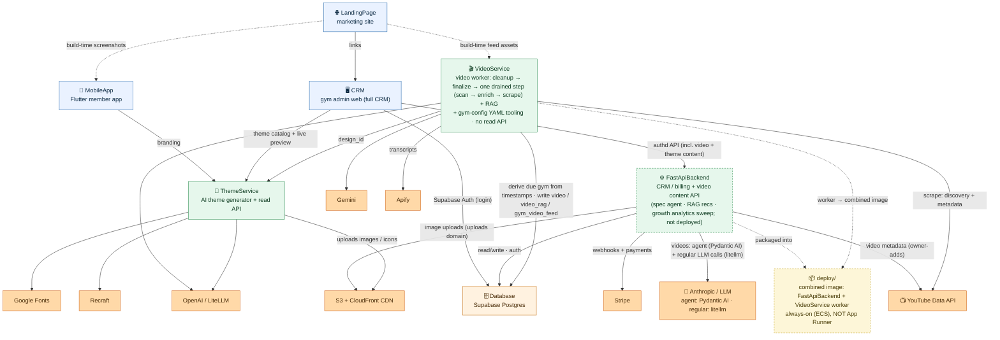

# CombatDen — System Map

CombatDen is a **white-label engagement platform for combat-sports gyms**: a member app, a
gym-owner admin **CRM**, a marketing site, an AI theme generator, a curated video pipeline, a
membership/billing backend, and one shared Supabase database underneath all of it.

This repo is a **monorepo of 7 independent systems**. The graph below is the **high-level map** —
the systems and how they wire into each other. For the full picture (every system opened up to its
inner nodes, ThemeService's creation vs read-API split, the VideoService worker's pipeline,
skills/scripts), see **[`architecture.mermaid`](architecture.mermaid)**.

---

## The big graph

### Legend

- **Top-down = data/request flow.** Client apps up top, the backend services in the middle, the shared Database and external third-party services at the bottom.
- **Colors:** blue = client apps · green = backend services / engines · **orange = the shared Database and all external third-party services** · yellow = the combined `deploy/` image (operational packaging).
- **Dashed box border = built but not yet deployed.** The CRM has been **restored to a full gym-admin CRM** — Supabase-auth login, members list + member detail, gym setup, and the Stripe billing surface are built natively and wired to the FastApiBackend over an authenticated `dio` client; its ThemeService read stays live. The **FastApiBackend** that backs it is built (members/gyms/classes/ranks/rewards + memberships/plans/discounts/payments/webhooks + the merged `videos` + `presets` domains + the `uploads` image-proxy domain + the `reports` CSV/zip-export domain) but has **no prod host yet** (`api.combatden.net` pending). The **rewards system is now productionized**: attendance auto-award, manual admin adjust, a member-initiated pending → staff approve/reject flow (rejection refunds points), staff-initiated redemption, and image uploads for the reward catalog and member photos via the `uploads` domain. Billing's failed-payment / dunning / refund edge handling is now covered by the Stripe webhooks + a twice-daily reconciler sweep (a few optimizations still deferred). **VideoService** now runs the video content as a background worker whose tick is **decoupled DB-backed steps, not a per-gym pipeline**: every tick runs cleanup (drop strike-maxed videos) + finalize (complete/fail `running` runs purely from their feed rows) for free, then drains **ONE heavy step, first-with-work** — scan (a global multimodal verdict sweep) → enrich (a global, gym-agnostic RAG-building sweep) → scrape (the only quota-bound, run-opening, per-gym step — it alone still derives its due gym from timestamps already in the schema, no job queue) — that owns the shared `video_*` pool and builds the per-video RAG layer (a pre-populated `video_rag` template sidecar seeds most of it on `make sync-gyms`, so a freshly-imported preset feed serves instantly); every client reads video content via FastApiBackend — VideoService **no longer serves a read API**, and MobileApp is being rebuilt without a live VideoService backend. The dashed **`deploy/`** node is the combined always-on image (FastApiBackend API + the VideoService worker) — the production target, not yet live.
- **Solid arrow = a live runtime dependency** (HTTP, DB read/write, third-party API). **Dashed arrow = build-time or operational** — e.g. LandingPage capturing screenshots/feed assets at build time.
- **Every arrow connects siblings** — at this level, system → system or system → external service.
- **Want the inner workings?** `architecture.mermaid` opens every box up: the creation vs read-API split for ThemeService, the VideoService worker's pipeline, and the skills/scripts that operate each engine. Render it with the `mermaid-creation` skill (`npx @mermaid-js/mermaid-cli -i architecture.mermaid -o architecture.svg`).

---

## The 7 systems

**📱 MobileApp** — Flutter member-facing app (the product members would use). It is **being rebuilt** and no longer has a live VideoService backend — the video feed, gym detail (classes + rewards), home, booking, and profile are a high-fidelity prototype. Branding is resolved at runtime through the shared `theme_flutter` package. *Talks to:* ThemeService (branding).

**🖥️ CRM** — Flutter **web** gym-owner admin app (formerly AppManagement). The **full CRM**, restored from the old FlutterCRM and rebuilt natively in AppManagement's design: a **Supabase-auth** login gate, **members list + member detail** (memberships, invoices, charges, discounts, linked accounts + their action dialogs), **gym setup** (Stripe Connect onboarding), and the **Stripe billing** surface — all built on BLoC + repositories calling **FastApiBackend** through an authenticated `dio` client (`lib/core/network/api_client.dart`, Supabase-JWT interceptor). Video content (gym feed, spec) is served by **FastApiBackend** via the `videos` domain; the gym showcase (branded class/reward cards) is served via the `theme` domain. The **Theme tab's picker** pages **ThemeService**'s style catalog directly (`GET /apps/{id}/styles`, category-filterable) for a live re-themed phone preview — demo class/reward cards come from FastApiBackend's public, category-keyed `theme` showcase-defaults, with bundled constants as the offline last resort — and an admin can persist the pick as the gym's app theme (`PUT /api/v1/gyms/{id}/theme`, boots on the gym's saved choice next time). This module also ships as the standalone public **theme browser** at `themes.combatden.net`. Billing's failed-payment / dunning edge cases are now covered by webhooks + a twice-daily reconciler sweep (a few optimizations deferred) and the backend isn't deployed yet, so end-to-end runs against a local FastApiBackend. *Talks to:* FastApiBackend (auth'd — billing + video + theme content), Supabase (auth), ThemeService (read-only style catalog + branding). Deploys to `app.combatden.net` + `themes.combatden.net`.

**🌐 LandingPage** — Marketing site (React via CDN + Babel, no bundler) at `www.combatden.net`. Hero phone carousel, feed demo, loyalty loop, pricing. It makes no live API calls — its screenshots are captured from MobileApp and its feed thumbnails are pulled from VideoService **at build time**, then baked into the deploy. It links out to the theme browser. *Talks to:* CRM (link), MobileApp + VideoService (build-time assets only).

**⚙️ FastApiBackend** — Python/FastAPI membership + billing + video content backend (the CRM's API). Routers for members, gyms (incl. gym profile — name/description/logo — and persisting a gym's chosen ThemeService design, `PUT /{gym_id}/theme`), classes, ranks, rewards (approval flow + points earning), waivers, **`employees`** (the gym's staff roster — list/create/update/soft-archive, with `invite_status` derived at read time), discounts, plus the billing subsystem — membership plans, member memberships, payments, and Stripe webhooks — three video/theme domains: **`videos`** (authed real-gym feed + LLM spec/agent authoring surface — `VideoSpecService`, `VideoQueryGenerator`, `VideoSpecAuthoring`, `VideoFeedRefiner` as standalone general services using **litellm** (`LiteLLMClient`) for structured calls, plus `VideoAgentService` as a thin **Pydantic AI** conversational agent wrapper; one-way layering: agent → `VideosService` facade → services; plus a **RAG read surface** — `VideoRecsService` single rotating-category member recs (recorded in `member_video_recs`) + an optional member-personalized feed order, both ranked by **pure cosine similarity** against the worker's `video_rag` embeddings via a per-member taste profile on the `members` row; the rec is a thin wrapper over the feed (no composite blend or stored score); there is no semantic-search route), **`presets`** (public slug-keyed template catalog via `PresetsTemplateService` + owner-gated import of a template into a gym's live tables — the Settings → Gym Presets surface only; the CRM's theme picker does not use this catalog), and **`theme`** (a real gym's showcase — branded class/reward cards via `ThemeShowcaseService` — plus the **public**, category-keyed showcase-defaults via `ThemeShowcaseDefaultsService`, bundled demo content for the standalone theme browser) — and an **`uploads`** domain (`POST /api/v1/uploads/image` — multipart S3 proxy → `cdn.combatden.net`, feeding the CRM's reward-catalog, member-photo, gym-logo, class-image, rank-belt, and plan-card uploaders), a **`reports`** domain (owner/admin-gated CSV/zip downloads: a monthly or all-time operational report + a full raw per-table data export, `GET /api/v1/gyms/{gym_id}/reports/…`), plus **`member_portal`** — the **member-facing** surface (13 routes under `/api/v1/member`, the MobileApp's backend surface), gated by `Auth.verify_member_self` (the caller's verified email must equal the target member's email, on a confirmed auth account, in the path gym) and otherwise thin delegation to the same services the CRM uses: own profile (rank/points/streak/memberships/redemptions), class history, the gym schedule board, own reservations, the active reward catalog + a pending redemption, and the personalized video feed/rec/click. It is the ONLY caller of `verify_member_self` — no CRM route has an "or the member themselves" branch. A service/SQL layer; Supabase-JWT auth; Python 3.13. **Staff authorization is four roles** — owner / admin / front_desk / trainer — resolved per gym by matching the **verified JWT email** against the `gym_employees` roster (there is no `user_id` FK; a matching non-archived row *is* the access, which makes multi-gym staff native). Every gym-scoped route declares its role set; see the `employees-guide` skill for the capability matrix. The request/response contract lives in the backend's Pydantic schemas (`src/<domain>/<domain>_schema.py`). *Talks to:* Database (read/write + Supabase Auth), Stripe (payments + webhooks), Anthropic/LLM provider (video spec agent via Pydantic AI; query gen + feed refiner + RAG embeddings via litellm), YouTube Data API (owner-added video metadata), S3/CloudFront CDN (image uploads). **Built and wired to the CRM, not yet deployed** (prod target `api.combatden.net`); billing's failed-payment / dunning / refund edge handling is now covered by the Stripe webhooks + a twice-daily reconciler sweep (a few optimizations still deferred).

**🎬 VideoService** — owns the gym-video content as a self-scheduling **background worker** (`src/worker`, `make worker`) plus the gym-config YAML tooling — it **serves no read API**. Each tick runs three DB-backed steps under one lock hold: **cleanup** (delete videos at the failure-strike ceiling) and **finalize** (complete/fail every `running` run purely from its feed rows — 90% terminal completes, a zero-row or 24h-stuck run fails) run every tick for free; then **ONE heavy step, first-with-work, is drained fully** — **scan** (a global multimodal keep/drop sweep judging each gym's pending candidates against its LATEST spec) → **enrich** (a global, gym-agnostic sweep that gives every un-enriched video ONE multimodal classify+summarize+embed pass, building the `video_rag` layer) → **scrape** (the only quota-bound, run-opening step — it alone still derives its due gym from timestamps already in the schema, no job queue: a fresh `admin_update` spec version or a 7-day periodic refresh, tier-sorted, capped per-gym and system-wide over a rolling 24h; **YouTube Data API v3**, free within quota — manual feed curation does NOT open a scrape; it mints a `feed_update` spec version the **scan** step re-judges the gym's existing auto feed against in place, ~1h later, zero downtime). A one-time `make enrich-templates` run pre-populates a `video_rag` sidecar for the shared template pool so a freshly-imported preset feed serves instantly instead of waiting for the worker. Gym-config **authoring** stays operator-driven (`gym_maker` + `make sync-gyms`). Every client reads the worker's output through the FastApiBackend `videos` domain — the worker and the backend never call each other, the database is the handoff. In-depth worker flow: `VideoService/worker.mermaid`.

**🎨 ThemeService** — the AI theme generator, also **two separate halves**. The **CREATION generator** (the `brand-brief` skill authors `customization.yaml`; the async-DAG orchestrator runs the color/font/image/icon/text/lottie modules; the `writer` emits `output.yaml`; the uploader pushes assets to the CDN — all operated by the `edit_theme` skill and the `regen`/`regen_image`/`edit_customization`/`expand`/`remove_bg`/`sync_assets`/`fetch_icon_sets` scripts) talks to Google Fonts, Recraft, OpenAI/LiteLLM, and AWS S3 + CloudFront. The **READ API** at `theme.combatden.net` (`/apps/{id}/styles`, plus the shared `ThemeFlutter` client package the apps import) only serves the produced `output.yaml`. Handoff is the artifact, not a call.

**🗄️ Database** — The shared **Supabase Postgres** that everything converges on. Holds `supabase/schemas/*.sql` (tables), `access_rules/*.sql` (RLS), and Python enum mirrors in `python_data/schema/`. Table domains: member, gym, rank/reward, membership + billing (Stripe-gated), class scheduling, and the `video_*` tables. *Consumed by:* FastApiBackend and VideoService directly; Supabase Auth also backs CRM login.

---

## How they connect (the load-bearing wiring)

- **CRM is wired to FastApiBackend for all content.** CRM authenticates with Supabase, then calls FastApiBackend over an authenticated `dio` client (`api_client.dart` + JWT interceptor). The members list/detail, gym-setup, billing screens, and video content (gym feed + spec via `videos` domain; a real gym's showcase via `theme` domain; template catalog via `presets` domain, Settings-only) are all dispatched through BLoC → repositories → the API. The Theme tab's own picker + branding stays a direct **ThemeService** edge (its style catalog, category-filterable, and per-style assets); persisting the picked design (`PUT /gyms/{id}/theme`) and the phone preview's public, category-keyed demo content (`GET /theme/showcase-defaults`) are ordinary FastApiBackend calls. The backend isn't deployed yet, so end-to-end runs against a local FastApiBackend on `:8000`.
- **One shared database is the hub.** FastApiBackend and VideoService both read/write the same Supabase Postgres. They stay consistent by importing enum mirrors from `Database/python_data/schema/` and honoring the backend's Pydantic schemas as the request/response contract.
- **The video worker's output is decoupled from its readers by the shared tables.** ThemeService-CREATION writes `output.yaml` (+ CDN assets) that ThemeService-API serves; the VideoService **worker** writes the `video_*` / `gym_video_*` / `video_rag` tables that the FastApiBackend `videos` domain reads (feed + RAG recs) to serve every client — VideoService itself serves no read API. The FastApiBackend never triggers the worker directly — there is no enqueue and no manual-run route; the worker derives its own work from timestamps the FastApiBackend's writes leave behind (an `admin_update` spec version drives a scrape; a `feed_update` version minted from manual feed curation drives an in-place scan re-scan) — no direct call crosses the two.
- **One shared Flutter package is the theming backbone.** `ThemeService/ThemeFlutter` is imported by **both** MobileApp and CRM (`../ThemeService/ThemeFlutter`) — it fetches and caches each tenant's branding and resolves colors/fonts/images at runtime.
- **VideoService points at ThemeService for branding.** Each gym's YAML stores a ThemeService `design_id`, so the curated feed and the visual theme line up per gym.
- **LandingPage is downstream of the apps at build time.** Its phone screenshots come from MobileApp and its feed thumbnails from VideoService — captured and baked in, not fetched live — and it links to the CRM theme browser.
- **Stripe drives billing.** FastApiBackend processes payments and ingests Stripe webhooks, syncing membership/billing state into the Stripe-gated (service-role-only) tables.
- **The CDN delivers all generated imagery.** ThemeService uploads images/icons to `cdn.combatden.net` (private S3 + CloudFront OAC, cache-busted on `?v=`); the web apps render straight from that CDN.

---

## Production topology

| Domain | Infra | Serves |
|---|---|---|
| `www.combatden.net` | CloudFront → S3 `combatden-landing-www` | LandingPage |
| `app.combatden.net` | CloudFront → S3 `combatden-app` | CRM (admin web) |
| `themes.combatden.net` | CloudFront → S3 `combatden-themes` | CRM (theme-browser target) |
| `theme.combatden.net` | App Runner → ECR `combatden-themeservice` (:8000) | ThemeService read API |
| `video.combatden.net` | (retired App Runner) | — VideoService read API decommissioned; the worker runs in the combined `deploy/` image |
| `cdn.combatden.net` | CloudFront → S3 `combatden-assets` (OAC) | Theme images / icons |
| `api.combatden.net` | not yet deployed (WIP) | FastApiBackend |
| — | Supabase (managed Postgres + Auth) | Database |

Full deploy/runbook detail (DNS, ECR push, App Runner env vars, CDN provisioning, pause/resume) lives in **`DEPLOYMENT.md`** — this README intentionally doesn't duplicate it.

---

## Repo layout

| Directory | What it is | Deeper docs |
|---|---|---|
| `MobileApp/` | Flutter member app | `MobileApp/CLAUDE.md`, `MobileApp/README.md` |
| `CRM/` | Flutter gym-admin web CRM + theme browser | `CRM/CLAUDE.md`, `CRM/README.md` |
| `LandingPage/` | Marketing site (React via CDN) | `LandingPage/CLAUDE.md` |
| `FastApiBackend/` | Membership + billing REST API (not yet deployed) | `FastApiBackend/CLAUDE.md` |
| `VideoService/` | Video worker + gym-config YAML tooling (no read API) | `VideoService/CLAUDE.md`, `VideoService/README.md` |
| `ThemeService/` | AI theme generator + read API + `ThemeFlutter` pkg | `ThemeService/CLAUDE.md`, `ThemeService/README.md` |
| `Database/` | Supabase schema, RLS, enums | `Database/CLAUDE.md` |
| `deploy/` | Combined FastApiBackend + VideoService-worker image (always-on target) | `deploy/CLAUDE.md` |
| `architecture.mermaid` | Full detailed system graph (inner nodes) | rendered via the `mermaid-creation` skill |
| `DEPLOYMENT.md` | Production deploy runbook | — |
| `CLAUDE.md` | Monorepo-wide working conventions | — |

Each system directory has its own `CLAUDE.md` with system-specific conventions — read those before working inside a system.
