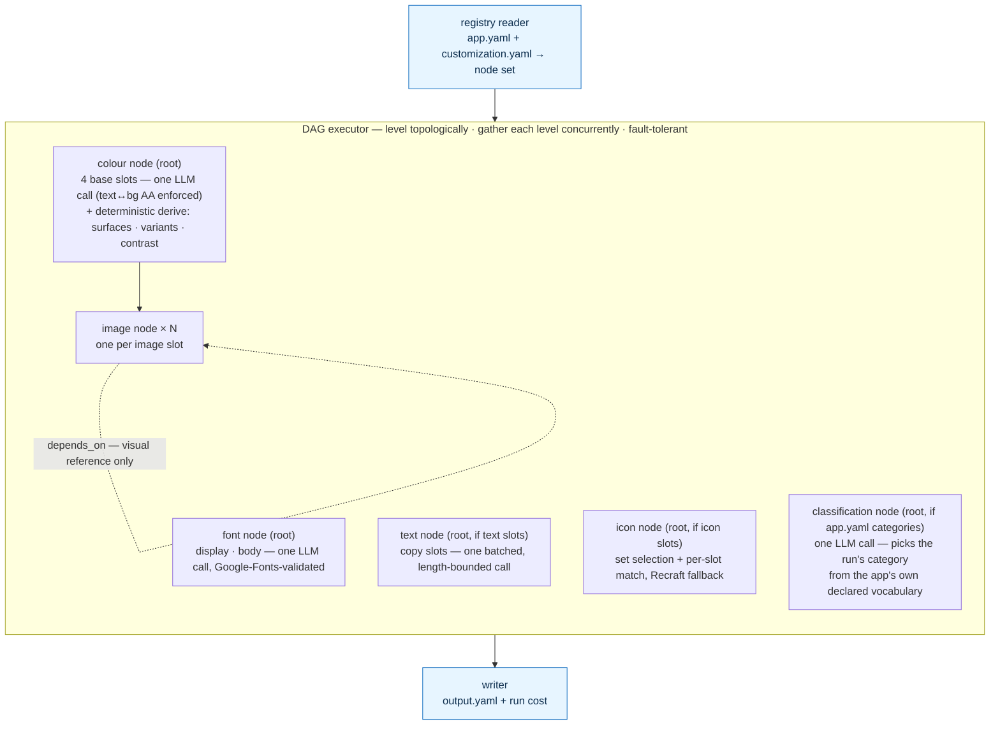
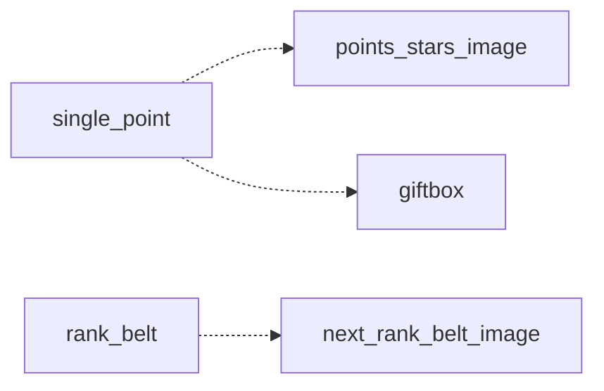
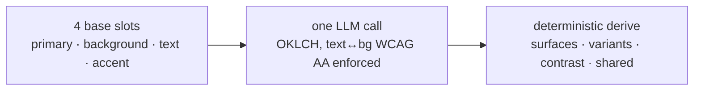
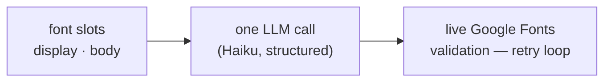
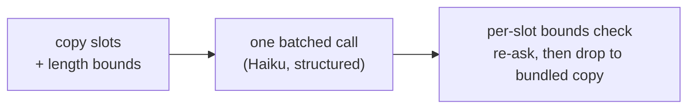
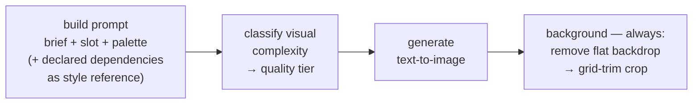
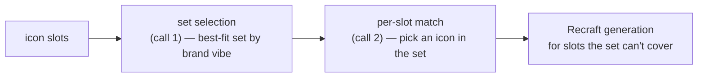
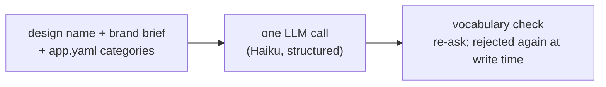

# Theme Service

Takes a brand brief, produces a fully customized app.

---

## How it works

Two YAMLs you write (`app.yaml`, `customization.yaml`), one the pipeline
produces (`output.yaml`). Customized surface: **images, colours, fonts,
text, and icons** — plus the run's own **classification**.

The pipeline is a **dependency DAG**, not a fixed sequence. The registry
turns the two YAMLs into a node set — one **colour node**, one **font
node**, plus a **text node**, an **icon node** and a **classification
node** (each built only when the app declares the matching inventory),
and one **image node per image slot**. The executor levels that graph
topologically and resolves each level **concurrently**.

Colour, font, text, icon and classification are the **level-0 roots** and
run side by side: the colour node resolves the four base slots in one
structured LLM call and then **derives the full palette deterministically**
(elevated surfaces, faded variants, contrast — see *Colour* below), the
font node picks every font in one call (validated live against the Google
Fonts catalogue), the text node rewrites every copy slot in one batched,
length-bounded call, the icon node matches each slot against a curated set
(generating any the set can't cover), and the classification node files the
run into one of the app's declared `categories` (see *Classification*
below). The font, text, icon and classification roots have no dependents.
**Every image node depends on the colour node** — image nodes paint with
the palette. An image slot may also declare `depends_on` other image
slots — a **soft reference** for **visual continuity**: the dependency's
look is folded into this slot's prompt as a style reference (never fed in
as an input image).

The graph is validated (acyclic, every dependency satisfied) **before
any paid call**. The run is then **fault-tolerant**: a node that fails
skips only its transitive dependents — every other node still resolves
and is written. The writer assembles whatever resolved into
`output.yaml` and totals what the run cost.

### Watching a run happen

A run is **timed and observable**. Every node is measured with
`perf_counter` from the moment it acquires the concurrency semaphore (its
own work, not its wait), and the whole run is timed end to end; both are
logged on every run, sink or no sink — so "how long does a run take" is now
a question with an answer.

`Pipeline.run()` also takes an optional `progress` sink. Given one it
narrates itself — run started, each level, each node's start / finish
(with its elapsed) / failure (with the error), and the run total with its
cost. Given none (what the CLI passes) nothing is emitted and the run is
byte-for-byte what it always was.

Because the **executor** owns iteration, that is where every emission lives:
the modules carry no progress code at all. The sink is an interface
(`src/executor/progress_sink.py`) over a plain Pydantic event
(`src/executor/progress_event.py`) — the pipeline core stays
transport-agnostic and knows nothing of HTTP or SSE. The `studio` app is
the one implementation today (see *The studio* below).

The whole graph, conceptually (which roots and per-slot nodes appear
depends entirely on what the app's `app.yaml` declares):



> Entry point: `src/executor/orchestrator.py`. Provider choices (which
> model, which provider) are architecture, not pipeline logic — each
> call's model id is a per-call constant at the top of the module that
> makes the call, not a config/env knob; only secrets (API keys) stay in
> `config.py`.

### A concrete `depends_on` example — combatden

The `combatden` app (10 image slots, 4 colour slots, 2 font slots, 5 text
slots) is the worked example for `depends_on` visual continuity: the
`single_point` star feeds `points_stars_image` and `giftbox`, and
`rank_belt` feeds `next_rank_belt_image` so the next tier reads as a
deliberate step up from the current one. Those edges deepen the image
sub-graph without changing how the executor levels it.



---

## The modules

Six atomic modules: one per customized surface (colour, fonts, text,
images, icons) plus the run's own classification. Each resolves the
smallest indivisible unit (the executor owns iteration); the module
itself never loops the slot inventory.

### Colour — one paid call, the rest derived



A usable theme is far more than four brand colours. A real UI needs
elevated **card** and **popup** surfaces, **dividers**, dark/light
variants, and faded secondary/tertiary text — and every one of those has
to stay legible on whatever background the brand picked. The pipeline
owns all of it, so each client reads a finished palette instead of
re-deriving (and re-guessing) surfaces itself.

The single colour LLM call resolves only the **four base slots**
(`primary`, `background`, `text`, `accent`) as OKLCH values, under a
contract checked **before the result is accepted**: `text` must clear
**WCAG AA (4.5:1)** against `background`, text lightness is pinned by
mode (near-white in dark, near-black in light), and base colours stay
low-chroma. A breach rides the same retry loop and is re-asked.

Everything else is computed in Python — **no extra LLM calls, fully
deterministic and repeatable**:

- **Background correction** clamps the canvas lightness into a safe band
  so elevated surfaces have tonal headroom (dark mode pulls it down,
  light mode pulls it up).
- **Per-slot derivation** expands each base slot into seven variants:
  `second`/`third` (faded alpha tints for secondary/tertiary text),
  `card`/`popup` (translucent and opaque surfaces), `dark`/`light`
  (lightness-shifted variants forced to read clearly above or below the
  canvas), and `regular_text` (a readable foreground for text painted ON
  the colour — the body `text` colour if it clears WCAG AA against the
  fill, else whichever of text/background contrasts better).
- **Shared surfaces** computes the run-wide `card` (neutral elevation
  veil), `popup` (that veil composited onto the canvas), and `divider`
  (a hairline keyed to the text colour) once for the whole theme.

The run carries one resolved **`mode`** (light or dark) and emits a flat,
ready-to-consume palette (`primary`, `primary_card`, `background_dark`,
`card`, `divider`, …). This is what lets the client become a plain
consumer — the interim surface math each client used to carry is gone.

### Fonts



One structured call picks every font; a pick that isn't a real Google
Fonts family is rejected and re-asked on the retry loop.

### Text



One batched call rewrites every copy slot to the brand voice. Each
returned value is checked against its declared word/character bounds;
over-long slots are re-asked, then dropped so the client falls back to
its bundled string.

### Images

Each image node resolves **one** image end to end (atomic; the executor
owns iteration):



Generation is text-to-image only (no style-adherence check, no corrective
edit), and declared dependencies are folded into the prompt as reference,
never fed in as input images. The background pass (remove → two-pass
grid-trim crop) runs no cutout-quality check.

### Icons



Two LLM calls pick a brand-fitting curated set and match each slot to an
icon in it; any slot the set can't honestly cover is generated via
Recraft. Icons are monochrome (`currentColor`) so the app tints them per
theme — there is no per-slot colour field.

### Classification



Every run's `output.yaml` carries a top-level `category`, and the style
picker **requires** it: `GET /apps/{app_id}/styles` skips any run with no
category, or whose category isn't in the app's declared vocabulary. The
classification node is what produces it, so a new theme lands listable with
no manual step.

The node reads only the design name and the brand brief — never the resolved
colours or images — so it is a level-0 root and costs the run no wall-clock
time (about $0.003 a run).

**App-agnostic, like everything else.** The buckets come from the app's own
`app.yaml`:

```yaml
categories:
  - Fighting
  - Yoga
  # …
```

No class value exists in Python. The response schema is built **per request**
from that list and a validator rejects anything outside it, so an invented
value is fed back and re-asked on the existing structured-output retry loop
rather than written. An app that declares no `categories` never gets the node
at all and runs exactly as it did before — the styles endpoint skips the
vocabulary check for such an app too.

The value is then checked **again at write time**, because a category the
app doesn't declare has no loud failure mode — the theme just quietly stops
appearing in the picker:

- A value this pass **produced** that isn't declared fails the write. It
  cannot happen through the node (the schema is built from the vocabulary),
  so it is an assertion against a bug, not a data path.
- A value **carried forward** from the run's existing `output.yaml` that the
  app no longer declares is stale data, not a bug in this pass — it is logged
  as an error and dropped, and the run is still written (the pass already
  spent money). Re-file it with `regen --slot category`.

Because classification is a node and not a bolt-on step, it inherits every
reopen lever for free: `expand` **backfills** a run that has no category,
`regen --slot category [--spec "…"]` re-rolls one that was mis-filed, and a
run that is already classified seeds the node done — reopening it never
re-spends on classification. A full in-place re-run re-classifies from the
brief exactly as it re-makes every other slot; the value on the file being
overwritten is kept only as a fallback for when nothing was produced (the app
declares no vocabulary, or the call failed), so a blip never drops a listed
theme out of the picker.

---

## Configuration

The app reads a single `.env` (via pydantic-settings). Copy `.env.example`
to `.env` and fill in the `TODO-…` values.

`.env.example` is the authoritative list of every key the pipeline needs —
each is documented inline there. This README deliberately does not repeat the
key list, so it can't drift out of date when keys are added or removed.

---

## App-agnostic by construction

The pipeline knows nothing about any specific app. The slot inventory,
slot names, slot descriptions, and the `depends_on` edges live entirely
in `app.yaml`. Point the same pipeline code at a different `app.yaml` and
you customize a different app — no code changes, no rebuild, one new YAML
directory.

That's the success criterion. The framework stays one codebase; every
new app is one new `apps/<app_id>/` folder.

---

## Reopening a run: expand, regenerate, steer

A finished run is a directory (`apps/<app_id>/<run_id>/`) holding its
`app.yaml`, `customization.yaml`, and `output.yaml`. You can **reopen** it to
fill in or re-make individual slots **in place**, paying only for what
actually re-runs — no full re-generation.

The whole thing rests on one idea: **the `seed` decides what's preserved.**
`build_seed` reads `output.yaml` into a slot-level map (`{slot_id → that
slot's saved output}`). The executor hands each node its slice; a node
re-makes any of its declared slots **absent from the seed** and keeps the rest
verbatim, feeding the kept ones into the LLM as fixed context so a re-made slot
stays in harmony (colour also re-checks WCAG-AA against the fixed
background/text). A node whose slots are all seeded does no work. So **to
re-roll a slot you just drop it from the seed** — the scripts do exactly that.

The run's classification joins that same map under the pseudo-slot id
`category` (it is one run-wide value, not a per-slot inventory), which is what
makes it expandable, regenerable and free to preserve like everything else. It
seeds only when the saved value is still one of the app's declared
`categories`, so a stamp that went stale against a changed vocabulary is
re-made rather than carried.

Steering rides one object, `OverwriteSpecs`, threaded through and recorded on
every per-item output (so a slot says what produced it) and on the ledger:

- `specs` — the free-text instruction; the agent says everything in words
  here, including anything to avoid ("make it warmer, not orange").
- `image_to_image` — image module only: present ⇒ edit the current image.

It's the agent's job to fill `OverwriteSpecs` with what's useful; new
per-module knobs are new fields here, not new wired parameters.

Three standalone entrypoints (run from the package root, like `make`):

- **`scripts/expand`** — `--run-dir <dir> [--app-yaml <path>]`. Generates only
  the slots declared in `app.yaml` but missing from `output.yaml` — resume a
  partial run, fill newly-added slots, or **backfill the classification** of a
  run that has none. The run dir's `app.yaml` is a frozen snapshot, so to
  expand against an **updated** inventory pass the live one (`--app-yaml
  apps/<app_id>/app.yaml`); the snapshot is then refreshed to match. That is
  also how an older run reaches a vocabulary its snapshot predates.
- **`scripts/regen`** — `--run-dir <dir> --slot <id> [--slot <id> …]
  [--spec "…"]`. Re-makes one or more colour/font/text/icon slots — or
  `category`, the classification node's single pseudo-slot — preserving
  everything else. Naming several slots of one atomic node re-rolls them
  together (harmonised). Images are out of scope here.
- **`scripts/regen_image`** — `--run-dir <dir> --slot <image_id> [--spec "…"]
  --mode create_new|edit_current_image`. `create_new` generates a fresh image;
  `edit_current_image` edits the existing one (image-to-image — the prompt says
  only *what to change*). The prior image is kept as a numbered file in the
  run's `images/` dir (`<slot>.v1.png`, …); there is no version history in
  `output.yaml`.
- **`scripts/edit_customization`** — `--file <customization.yaml>` plus the
  five flattened optional fields (`--name`, `--short-desc`, `--long-desc`,
  `--colors-description`, `--mode light|dark`). A validated, targeted edit of
  the brand brief (only the flags you pass change; the file is re-validated
  before writing). It edits the brief only — regenerates nothing; `regen` the
  affected slots (or do a full run) to apply it.

The first three preserve `output.yaml`'s original `cost` and append one entry to
`expansion_cost.yaml` (the unified audit log): its `kind` (`expand` /
`regenerate`), the slots (re)generated, the `OverwriteSpecs` applied, and that
pass's spend.

## TODO

### Corner rounding — one paid call, the rest derived

Brand personality lives in corner radius as much as in colour: sharp corners
read technical and serious, generous rounding reads soft and friendly. Today
the client (`MobileApp`) hardcodes a fixed radius scale (`radiusSmall`,
`radiusBig`, `radiusCircle`) in `design_constants.dart`, so every app ships the
same geometry no matter the brand. That belongs here, alongside the palette —
resolved once per brand and emitted for the client to consume, exactly as the
colour surfaces now are.

The shape mirrors **Colour**: one structured LLM call picks a single **rounding
enum** — the brand's overall corner personality (illustrative:
`sharp` / `subtle` / `rounded` / `pill`) — and Python then **derives realistic
per-role pixel radii deterministically**, with no extra paid call and fully
repeatable. The roles match how UI actually uses radius — `card`, `popup`,
`button`, `small` (chips, inputs, list items), `large` (sheets, hero
containers), and a fully-round `pill`. The derive maps the chosen enum onto a
sensible pixel scale per role (a `sharp` brand lands near 0–4px, a `rounded`
brand near 12–20px; pill roles are always fully round).

Emitted as its own output group (e.g. `radius_set`) the client consumes
directly — the hardcoded radius constants in `design_constants.dart` then go
away, the same way the interim surface math did.

App-agnostic by construction: the role list and any per-app overrides live in
`app.yaml`, never in Python.

---

## Shipped

```
codebase/CustomizationService/
├── schema/              # Pydantic contracts for the YAMLs
│   ├── app_format, customization, primitives, slots,
│   │     color_role, color_mode, complexity
│   └── output/          # ColorOutput (+ Derivations), ColorValue,
│   │                    #   ImageOutput, FontOutput, TextOutput,
│   │                    #   IconOutput (+ IconAttribution),
│   │                    #   *Set wrappers (ColorPalette has mode),
│   │                    #   Output, RunCost
├── src/
│   ├── __main__, cli    # CLI entrypoint
│   ├── core/            # config, errors, run_context, logging, util
│   ├── executor/        # orchestrator (the DAG), registry, writer
│   ├── modules/         # base = Node + DependencyKind
│   │   ├── colors/      # ColorNode + scheme (LLM) / correction /
│   │   │                #   derivation / surface services, prompts/*.md
│   │   ├── images/      # ImageNode + complexity /
│   │   │                #   background services, prompts/*.md
│   │   ├── fonts/       # FontNode + font selection service
│   │   │                #   (Google Fonts catalog), prompts/*.md
│   │   ├── texts/       # TextNode + text generation service, prompts/*.md
│   │   ├── icons/       # IconNode + set selection / matching /
│   │   │                #   generation services, prompts/*.md
│   │   └── categories/  # CategoryNode + category selection service
│   │                    #   (the run's app.yaml-declared bucket), prompts/*.md
│   ├── shared/
│   │   ├── interfaces/  # LLMClient, ImageGenerator, BackgroundRemover,
│   │   │                #   GoogleFontsCatalog, IconSetCatalog
│   │   └── services/    # LiteLLMClient, LiteLLMImageGenerator,
│   │                    #   Recraft remover, Google Fonts catalog,
│   │                    #   local icon set catalog, Recraft icon generator,
│   │                    #   cost, prompts/*.md
│   └── api/             # read-only FastAPI over output.yaml
├── tests/               # core, modules, executor, pipeline, services, api
├── scripts/             # expand, regen, regen_image, edit_customization, …
└── apps/
    ├── combatden/       # app.yaml, customization.yaml, runs
    └── smoketest/       # app.yaml, customization.yaml, runs (every module)
```

`make test` runs the suite; `make run` customizes `apps/combatden/` end
to end, `make smoke` does the same on `apps/smoketest/` (the one app that
exercises all six modules); `make api` serves the read-only output API.
Entry point: `src/executor/orchestrator.py`. Read the schemas for the
exact YAML shapes; read `apps/combatden/` for a worked example.
