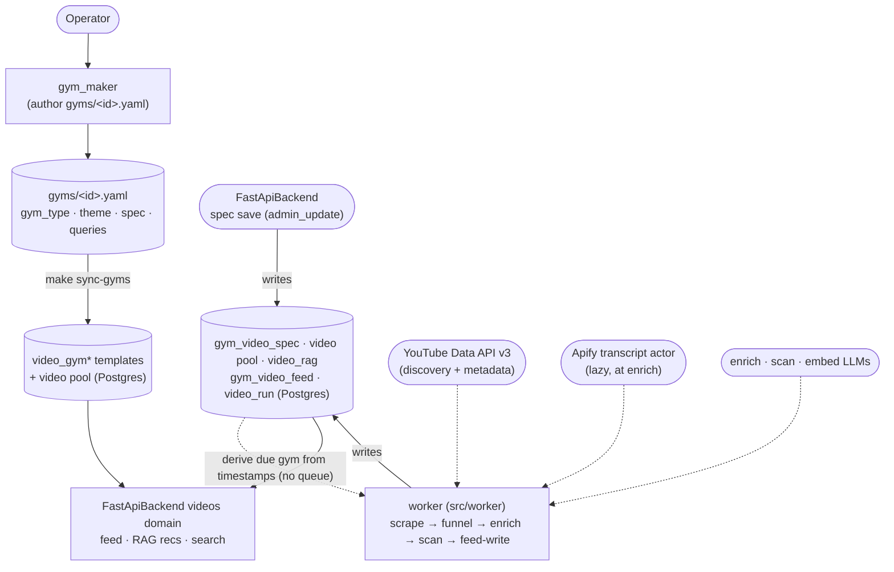

# Video Service

A lightweight, **single-tenant, gym-centric** service. The **gym** is the unit of
everything: a member browses gyms, picks one (by `gym_id`), and gets that gym's
videos / classes / rewards. The **theme it carries** is used only for branding
(loading the design), never to fetch content.

Data lives in the **shared Supabase Postgres** (the `video_*` tables defined in
`../Database/`). The hand-authored gym configs stay git-tracked YAML and are
loaded into SQL with `make sync-gyms`; everything machine-generated (the shared
video pool, each gym's curated feed, the spend ledger) lives only in Postgres:

```
gyms/<gym_id>.yaml   one gym — git-tracked source of truth, synced into SQL
video_gym + children (Postgres)   gyms, queries, classes, rewards
video                (Postgres)   the shared video pool (one row per video)
video_gym_feed       (Postgres)   each gym's curated good/rejected feed
cost_log             (Postgres)   generic append-only spend ledger (source='video')
```

The **background worker** (`src/worker`) writes the shared `video` pool, per-video
`video_rag` (summary + embedding), and each real gym's `gym_video_feed` runs;
`make sync-gyms` loads the authored templates. The FastApiBackend's `videos`
domain queries the `video_gym*` template tables and the worker's output to serve
the CRM and the public theme browser. There is **no tenant layer, no
`app_id`**. The theme→gym link is just each gym's `theme` field (a ThemeService
design id), so VideoService never reads ThemeService. (The legacy flat `videos/` +
`cost_log.yaml` files are only read once, by the `scripts.import_yaml` importer
(run by `make sync-gyms`), to seed the DB at cutover.)

## The gym

One `gyms/<gym_id>.yaml` carries everything about a gym:

```yaml
gym_id: vinyasa                       # stable id == filename stem
gym_type: [vinyasa]                   # 1+ disciplines (the GymType enum, 76 values)
theme: VinyasaFlow            # the ThemeService design id this gym runs
videos:
  specification:
    short_videos_desc: Led, full vinyasa classes, clear instruction.   # ≤2-sentence
    short_avoid_desc:  No talking-head philosophy or 30s social clips.  # skim summary
    videos_desc: Led full vinyasa classes, breath-paced, clear instruction.  # LONG —
    avoid_desc:  Talking-head philosophy, 30s social clips, gymwear hauls.    # scanned
  queries:                            # the searches that feed this gym's pool slice
    - vinyasa flow full class breath led
    - beginner vinyasa yoga 30 minutes
  good_video_ids: [abc123, def456]    # scan-approved feed (the ONLY list served)
  rejected_video_ids: [ghi789]        # scan-rejected (never served)
  scan_costs:                         # append-only per-gym scan-cost history
    - {at: 2026-05-28T12:00:00Z, usd: 0.0123}
classes: null                         # optional branded class cards (ClassImage)
rewards: null                         # optional points-store reward cards (RewardCard)
```

- **`gym_type`** is a list — a gym may span disciplines; the **first** is primary
  and the gym browser derives a coarse `parent_gym_type` (Fighting / Yoga /
  Pilates / Barre / HIIT / Cardio / Dance / Wellness) from it for the picker
  filter. It's also the **candidate filter**: a gym scans only the pool slice
  tagged with one of its disciplines.
- **`specification`** comes in two tiers: the long `videos_desc` / `avoid_desc`
  (required, the full context-rich criteria the **scan** judges against) and a
  short `short_videos_desc` / `short_avoid_desc` ~2-sentence summary for easy
  viewing (display-only, not scanned; optional until all gyms are backfilled).
- **`good_video_ids` / `rejected_video_ids` / `scan_costs`** are machine state —
  the scan owns them. Author them empty; never hand-edit.
- **Card art** (the gym's celebration image) is **derived by the FastApiBackend**
  from the theme — not stored on the gym.

## The shared video pool

`videos/<video_id>.yaml` is one de-duplicated `VideoOutput` per file; the pool is
simply the `videos/` directory (no manifest wrapper). It is **raw, shared, and
never user-facing** — the candidate store every gym draws from. Each record
carries two independent, content-derived axes:

- `tag` — one genre (`VideoType`).
- `gym_type` — the **list** of disciplines the content fits (routes the video
  into the slices gyms scan). This is **classification, not approval** — approval
  is per-gym, held on the gym's `good_video_ids`.

## Architecture

Two independent halves over the shared Postgres — they never call each other:



- **gym_maker** (operator) authors a gym file; `make sync-gyms` loads the template
  catalog + pool the FastApiBackend serves. Its guide is `references/gym_maker.md`.
- **the worker** (`src/worker`, self-scheduling — no queue, no backend trigger) derives
  the single highest-priority "due" gym each tick straight from timestamps already in
  the schema (a fresh `admin_update` spec version, a settled manual feed curation, or a
  weekly refresh floor), then runs the scrape → funnel → enrich → scan → feed-write
  pipeline — writing the shared `video` pool, per-video `video_rag`, and each real gym's
  `gym_video_feed` runs (the content the FastApiBackend serves: feed + RAG
  member-recs/search). It absorbed the old `scripts/scraper` + `scripts/scan` scripts.
  Its guides are `references/scraper.md` (ingest) + `references/scan.md` (judgment) in
  the `videoservice` skill.

> **One gym at a time.** The worker holds a global `"video_worker_run"` lock and
> processes one gym per tick; never run two pipelines at once.

For the worker's in-depth flow — `run_tick` (lock → orphan recovery → run caps → due-gym derivation → open run), the six pipeline stages, and the five `cost_log` rows — see **[`worker.mermaid`](worker.mermaid)** (render with the `mermaid-creation` skill).

## Cost log

The worker logs spend to the generic **`cost_log`** table (shared across every
cost-bearing system; VideoService always writes `source='video'`) — one row per
stage (`search` / `transcript` / `enrich` / `embed` / `scan`), each stamped with
`run_id` (TEXT, no FK), `gym_id`, `model` (NULL where not applicable), and
`cost_usd` (the row's USD total; `breakdown` still carries the component detail
map). `search` is **free** (the YouTube Data API within quota — its breakdown
carries the quota units), and `transcript` carries the lazy Apify transcript
spend. The legacy flat `cost_log.yaml` is only read once, by the
`scripts.import_yaml` importer, to seed the DB at cutover.

## The skill

One skill, `videoservice` (`.claude/skills/videoservice/`), with a lean router
`SKILL.md` plus one focused guide per job:

- `references/gym_maker.md` — author/edit a gym (the interview + the writable
  surface).
- `references/scraper.md` — run the scrape + classify.
- `references/scan.md` — run a scan (thin).

Use it to set up a gym, write a gym's videos config / classes / rewards, run the
scraper, or run a scan.

## Scripts + the worker

All run via **`poetry run`** (never bare `python3` / `.venv/bin/*`):

```bash
make gym-check GYM_ID=all          # validate gym files round-trip the Gym model
make sync-gyms GYM_ID=all          # load authored gym YAML -> SQL (idempotent; runs the import below)
poetry run python -m scripts.import_yaml.run   # one-time cutover: pool + feeds + cost log -> SQL
make worker                        # run the background pipeline (scrape → funnel → enrich → scan → feed-write)
```

`make sync-gyms` runs `scripts.import_yaml` internally with `--skip-cost-log` (so
re-runs never duplicate ledger rows); load the cost-log history once by hand with
the bare `scripts.import_yaml.run` above. `gym-check` / `sync-gyms` / the import
pick their DB via the `ENV_FILE` flag (default `.env`;
`ENV_FILE=.env.prod make sync-gyms GYM_ID=all`, or the `make sync-gyms-prod` helper
— prod secrets in the gitignored `.env.prod`). `make worker` is a long-running loop
against `.env` — it self-schedules (no queue, no backend trigger): run it locally
alongside the backend and it picks up a gym on its own next tick once a spec save /
feed curation / weekly floor makes that gym due.

Env in `.env`: `DATABASE_URL` (the scripts + worker), plus `YOUTUBE_API_KEY`
(worker discovery + metadata) and `APIFY_TOKEN` (worker transcript fetches, at
enrich), and the model keys (`GEMINI_API_KEY` for enrich/scan, `OPENAI_API_KEY`
for embeddings).

## Tests

```bash
make test   # unit + worker-pipeline tests — no DB required
```
