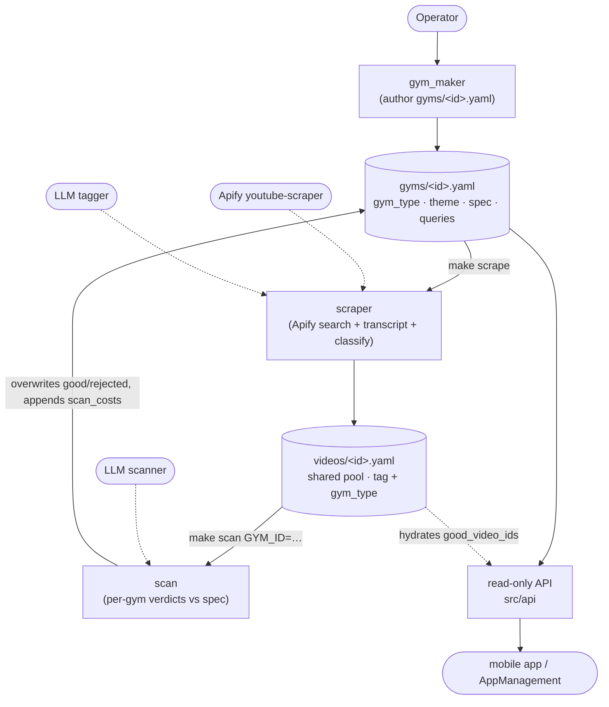

# Video Service

A lightweight, **single-tenant, gym-centric** service. The **gym** is the unit of
everything: a member browses gyms, picks one, loads the **theme it carries**, and
gets that gym's videos / classes / rewards.

Everything lives flat under `VideoService/`:

```
gyms/<gym_id>.yaml      one gym
videos/<video_id>.yaml  the shared video pool (one file per video, no manifest)
cost_log.yaml           append-only spend ledger
```

There is **no tenant layer, no `app_id`, no manifest**. The theme→gym link is
just each gym's `theme` field (a ThemeService design id), so VideoService never
reads ThemeService.

## The gym

One `gyms/<gym_id>.yaml` carries everything about a gym:

```yaml
gym_id: vinyasa                       # stable id == filename stem
gym_type: [vinyasa]                   # 1+ disciplines (the GymType enum, 76 values)
theme: ZZUndoneVinyasaFlow            # the ThemeService design id this gym runs
videos:
  specification:
    videos_desc: Led full vinyasa classes, breath-paced, clear instruction.
    avoid_desc:  Talking-head philosophy, 30s social clips, gymwear hauls.
  queries:                            # the searches that feed this gym's pool slice
    - vinyasa flow full class breath led
    - beginner vinyasa yoga 30 minutes
  good_video_ids: [abc123, def456]    # scan-approved feed (the ONLY list served)
  rejected_video_ids: [ghi789]        # scan-rejected (never served)
  scan_costs:                         # append-only per-gym scan-cost history
    - {at: 2026-05-28T12:00:00Z, usd: 0.0123}
classes: null                         # optional branded class cards (ClassImage)
rewards: null                         # optional points-store reward cards (RewardCard)
```

- **`gym_type`** is a list — a gym may span disciplines; the **first** is primary
  and the gym browser derives a coarse `parent_gym_type` (Fighting / Yoga /
  Pilates / Barre / HIIT / Cardio / Dance / Wellness) from it for the picker
  filter. It's also the **candidate filter**: a gym scans only the pool slice
  tagged with one of its disciplines.
- **`good_video_ids` / `rejected_video_ids` / `scan_costs`** are machine state —
  the scan owns them. Author them empty; never hand-edit.
- **Card art** (the gym's celebration image) is **derived by the API** from the
  theme — not stored on the gym.

## The shared video pool

`videos/<video_id>.yaml` is one de-duplicated `VideoOutput` per file; the pool is
simply the `videos/` directory (no manifest wrapper). It is **raw, shared, and
never user-facing** — the candidate store every gym draws from. Each record
carries two independent, content-derived axes:

- `tag` — one genre (`VideoType`).
- `gym_type` — the **list** of disciplines the content fits (routes the video
  into the slices gyms scan). This is **classification, not approval** — approval
  is per-gym, held on the gym's `good_video_ids`.

## Architecture



Three jobs, each its own script and its own section of the `videoservice` skill
(`.claude/skills/videoservice/`):

1. **gym_maker** — author/edit a gym file (its disciplines, theme, spec, queries,
   classes, rewards). Never scrapes or scans.
2. **scraper** — gather every gym's `queries`, fetch from Apify (search +
   metadata + channel avatar + inline transcript in one actor), and classify each
   pooled video (`tag` + `gym_type`). Gym-agnostic; never approves.
3. **scan** — for one gym (or all), judge the pool slice matching its disciplines
   against its `specification` and write the gym's `good_video_ids` /
   `rejected_video_ids`. **Overwrites** good/rejected each run; **appends** a
   `ScanCost` to the gym's `scan_costs`.

The natural order is **gym_maker → scrape → scan**, but the three are
independent. Spend from scrape + scan is appended to `cost_log.yaml`.

> **Sequential only.** Pipeline runs (scrape, scan) hit rate-limited providers —
> run **one at a time**, never in parallel.

## Cost log

`cost_log.yaml` is an append-only sequence of `CostEntry`:

```yaml
- execution_type: search          # SEARCH | TRANSCRIPT | TAG | SCAN
  at: 2026-05-28T12:00:00Z
  breakdown: {apify_usd: 0.18}    # cost components in USD
  note: 412 videos across 76 gyms
- execution_type: tag
  at: 2026-05-28T12:14:00Z
  breakdown: {llm_usd: 0.0123}
```

Each gym additionally keeps its own `scan_costs` history (one `ScanCost {at,
usd}` per scan run), so per-gym spend is auditable on the gym itself.

## Run the API

```bash
poetry install
make api          # uvicorn on http://localhost:8002
```

Read-only endpoints:

| Method & path | Returns |
|---|---|
| `GET /health` | liveness probe |
| `GET /gyms` | a **page** of the gym browser (`GymsPage`) — slim cards (id, disciplines, derived `parent_gym_type`, `theme`, derived `celebration_image_url`, counts). Paginate with `?limit=` (default 20, max 100) / `?offset=`; filter with `?query=` (substring over id / theme / discipline) |
| `GET /themes/{design_id}/videos` | a **page** of the theme's gym feed (`VideosFeed`) — **only that gym's `good_video_ids`**, hydrated from the pool in feed order. Paginate; filter with **either** `?video_type=<genre>` **or** `?big_group=<educational\|entertainment>` (both → `400`). `404` if the theme isn't mapped to a gym |
| `GET /themes/{design_id}/classes` | the theme's gym's branded class cards (`ThemeClasses`). `404` if unmapped or none authored |
| `GET /themes/{design_id}/rewards` | the theme's gym's points-store reward cards (`ThemeRewards`). `404` if unmapped or none authored |

The gym browser's `celebration_image_url` is **derived** from the gym's theme
(`/apps/combatden/{theme}/images/celebration_image`) — a ThemeService-relative
path the client absolutises against the ThemeService base URL, exactly like the
theme picker. It is not stored on the gym.

Interactive docs at `http://localhost:8002/docs`.

## The skill

One skill, `videoservice` (`.claude/skills/videoservice/`), with a lean router
`SKILL.md` plus one focused guide per job:

- `references/gym_maker.md` — author/edit a gym (the interview + the writable
  surface).
- `references/scraper.md` — run the scrape + classify.
- `references/scan.md` — run a scan (thin).

Use it to set up a gym, write a gym's videos config / classes / rewards, run the
scraper, or run a scan.

## Scripts

All run via **`poetry run`** (never bare `python3` / `.venv/bin/*`):

```bash
make gym-check GYM_ID=vinyasa     # validate one gym file round-trips the Gym model
make scrape                        # scrape + classify across every gym's queries
make scrape GYM_ID=vinyasa         # only one gym's queries
make scan GYM_ID=vinyasa           # scan one gym  (GYM_ID=all for every gym)
```

Env in `.env`: `APIFY_TOKEN` (scrape) and the tagging/scan model key (e.g.
`GEMINI_API_KEY`).

## Tests

```bash
make test
```
