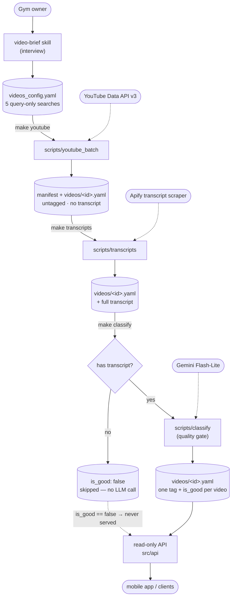

# Video Service

A lightweight, **temporary** demo service for a YouTube query system. Per company
it captures a `videos_config.yaml` brief — the business, the *kinds* of YouTube
videos worth surfacing, and what to avoid — plus a curated list of **query-only
search prompts** (the skill writes 5; the schema allows 1–20) spanning the full
content spectrum (educational → analysis → entertainment → news → interview →
vlog → professional → clips → memes).

Genre is **not** set on the searches. A search's tag was a poor proxy for what a
video actually is, so each video's genre — and a keep/drop verdict — is decided
**after** fetching, by a classification pass that reads the video's real content.

Five pieces:

- **`video-brief` skill** (`.claude/skills/video-brief/`) — the single end-to-end
  pipeline: a lean, question-driven interview authors `videos_config.yaml`, then it
  offers (each opt-in) to **fetch** the videos, **audit** them (remove anti-gym
  content), and generate the four branded **class cards** (`class_output.yaml`).
- **YouTube batch script** (`scripts/youtube_batch/`) — runs a brief's searches
  against the YouTube Data API v3 and writes the per-app feed (a manifest plus one
  file per video). Manual, run on demand. See [Run the searches](#run-the-searches).
- **Transcripts pass** (`scripts/transcripts/`) — fetches each video's transcript
  via Apify and caches it on the per-video file, so the classifier judges real
  content. Manual, run on demand. See [Fetch transcripts](#fetch-transcripts).
- **Classification pass** (`scripts/classify/`) — runs a Gemma model over each
  fetched video (title + description + runtime + transcript) to assign its genre
  `tag` and an `is_good` verdict, rewriting each per-video file. See
  [Classify the videos](#classify-the-videos).
- **Read-only API** (`src/api/`) — serves the validated brief, its search list,
  the classified videos (paginated + filterable), and the class cards,
  company-keyed. Modelled on CustomizationService's output API.

The per-app feed is **split on disk**: `apps/<app_id>/videos_output.yaml` is a
metadata-only **manifest**, and each video is its own file under
`apps/<app_id>/videos/<video_id>.yaml` (full transcript as the last key). The
read/write of this layout lives in one place (`VideosService`), which reassembles
the two halves into a single in-memory `VideosOutput` for every consumer.

The schema is expected to fold into `../FastApiBackend/` eventually; it's kept
separate now for speed.

## Architecture (high level)

The pipeline turns a company's intent into a concrete, cached, classified list of
videos — authored once, queried and classified occasionally, read constantly:



1. **Author** — the skill interviews a gym owner and writes `videos_config.yaml`:
   the business, what videos to surface/avoid, and query-only search prompts.
2. **Query** — the batch script reads that brief, runs each search against
   YouTube, enriches results (creator pfp, view/like counts, runtime), and
   de-duplicates videos that surface from multiple searches. **This is the only
   component that touches the YouTube API**, and its output is a cache — the API
   is hit once per query, not per app open. Videos leave this step **untagged**.
3. **Transcribe** — the transcripts pass fetches each video's caption text via
   Apify and caches it (whole) on the per-video file. It only fetches videos that
   lack one, so re-runs are cheap; videos without captions stay transcript-less
   and fall back to title + description.
4. **Classify** — the classification pass reads each fetched video's title,
   description, runtime, and transcript, judges it against the brief, and rewrites
   each per-video file with exactly one `VideoType` `tag` and an `is_good` verdict.
   It re-queries nothing, so it's cheap to re-run. **The transcript is the quality
   gate**: a video without one never reaches the LLM — it's flagged
   `is_good=false` (no genre, no classification cost) and so is never served.
5. **Read** — clients (the mobile app, the read-only API) consume the cached,
   classified output and group videos by `tag` for the genre feed. They never
   call YouTube, so end users consume **zero** API quota.

`schema/` is the shared contract across all five: `VideosConfig`/`VideoSearch`
(the brief), `VideosManifest` + `VideoOutput` (the split feed, aggregated as
`VideosOutput`), and `VideoClassification` (the classifier's per-video verdict).

## Run the API

```bash
poetry install
make api          # uvicorn on http://localhost:8002
```

Endpoints (read-only):

| Method & path | Returns |
|---|---|
| `GET /health` | liveness probe |
| `GET /apps` | company ids that have a `videos_config.yaml` |
| `GET /apps/{app_id}` | the full validated `VideosConfig` (the brief) |
| `GET /apps/{app_id}/searches` | the search list (query-only) |
| `GET /apps/{app_id}/videos` | a **page** of the **classified videos** (`VideosFeed`), **excluding off-niche ones** (`is_good == False`). Paginate with `?limit=` (default 20, max 100) and `?offset=`; filter with **either** `?video_type=<genre>` **or** `?big_group=<educational\|entertainment>` (both at once → `400`). `404` until the batch script has produced a feed |
| `GET /apps/{app_id}/classes` | the **4 branded class cards** (`ClassOutput`). `404` until the class-images step has produced a `class_output.yaml` |

`GET /apps/{app_id}/videos` serves a **slim, frontend-only** projection of the
feed: per video it returns `url`, `title`, `thumbnail_url`, `channel_name`,
`channel_url`, `channel_avatar_url`, `view_count`, `duration_seconds`,
`relevance_index`, `tag`, `is_good`, and `big_group`. The validation-only fields
(`description`, `like_count`, `source_queries`, and the full `transcript`) stay on
disk but are **not** sent over the wire. The response wraps the page in `total`
(matches before pagination), `limit`, and `offset` so the client can page.

`tag` and `is_good` are `null` until the [classification
pass](#classify-the-videos) has run. **Off-niche videos (`is_good == False`) are
filtered out server-side** — they never reach the client; unclassified (`null`)
videos still serve, so a freshly fetched, not-yet-classified feed isn't empty.

`relevance_index` is the video's best (lowest) position across the searches that
surfaced it — `0` is the top hit, lower is more relevant — for the frontend to
sort within a group.

`big_group` is the **primary frontend sort**: the coarse `educational` /
`entertainment` split derived from a video's single `tag` (`null` until
classified). Only `educational` and `analysis` map to `educational`; every other
genre maps to `entertainment`. (See `schema/big_group.py`.)

Interactive docs at `http://localhost:8002/docs`.

## Author a brief

Invoke the `video-brief` skill (e.g. "set up youtube searches for a new
company"). It interviews you, drafts query-only search prompts, validates against
the `VideosConfig` model, and writes `apps/<app_id>/videos_config.yaml`.

## Run the searches

Runs a brief's searches against the YouTube Data API v3 and writes the per-app
feed: a `apps/<app_id>/videos_output.yaml` **manifest** (run metadata) plus one
`apps/<app_id>/videos/<video_id>.yaml` per video. Manual — run it when a brief
changes, not on a schedule. A fresh run **replaces** the feed (stale per-video
files are cleared).

```bash
# one-time: put a key in .env (Google Cloud project with YouTube Data API v3 on)
echo "YOUTUBE_API_KEY=..." >> .env

make youtube APP_ID=combatden

# cheapest real end-to-end check — the one-search apps/smoketest brief (~100 units)
make smoke
```

Videos leave this step **untagged** (`tag`/`is_good` are `null`) and
**transcript-less** (`transcript` is `null`), filled by the
[transcripts](#fetch-transcripts) and [classification](#classify-the-videos)
passes. The batch carries `source_queries` (which search(es) surfaced each video)
and `duration_seconds`.

`apps/<app_id>/videos_output.yaml` (the manifest):

```yaml
company_name: Killer Muay Thai
app_id: combatden
generated_at: 2026-05-21T18:04:11Z
quota_units_estimate: 508          # YouTube Data API units this fetch cost
classification_cost_usd: null      # filled by `make classify` (its LLM spend)
```

`apps/<app_id>/videos/XXXXXXXXXXX.yaml` (one per video):

```yaml
url: https://www.youtube.com/watch?v=XXXXXXXXXXX
title: How to Throw a Teep Kick
description: ...
thumbnail_url: https://i.ytimg.com/vi/.../hqdefault.jpg
channel_name: Muay Thai Guy
channel_url: https://www.youtube.com/channel/UC...
channel_avatar_url: https://yt3.ggpht.com/...
view_count: 412903
like_count: 11820          # null if the creator hides likes
duration_seconds: 510      # null if the API reports no runtime (e.g. live)
tag: null                  # filled by `make classify`
is_good: null              # filled by `make classify`
reason: null               # why is_good is false (no_transcript / errored_out /
                           #   llm_classified_bad); null when good or unclassified
source_queries:            # the search(es) that surfaced it
  - how to throw a teep kick step by step
relevance_index: 0         # best search position; 0 = top hit, lower = more relevant
transcript_error: null     # why a transcript fetch failed (TranscriptNotFound, AgeRestricted, …)
transcript: null           # filled by `make transcripts` (always the last key)
```

### Quota / cost

The YouTube Data API is a **daily quota of 10,000 units** per Google Cloud
project (resets midnight PT) — not a per-request rate limit, and there is **no
pay-per-call pricing**. Costs:

| Call | Units | Used for |
|---|---|---|
| `search.list` | **100** (flat, 1–50 results) | the search itself — the cost driver |
| `videos.list` | 1 (per 50 ids) | view + like counts **and runtime** (`statistics,contentDetails` in one call) |
| `channels.list` | 1 (per 50 ids) | creator profile picture |

One brief (5 searches) ≈ **~500 units** (~100 per search, plus a handful of list
calls) → many full runs/day on the free quota. The script prints its
`quota_units_estimate` and
writes it into the output. Because the output is a **cache**, you pay the 100-unit
search cost once per query, not per app open.

**Need more?** There's no buy-more option — you request an increase via Google's
*YouTube API Services Audit and Quota Extension* form. Grants track demonstrated
usage (apps with real traffic routinely get 100k–1M units/day). At MVP scale the
free quota is plenty; the cache is what makes it stretch.

> Dislike counts are intentionally absent — YouTube removed `dislikeCount` from
> the Data API on 2021-12-13, so there is no dislike data to fetch.

## Fetch transcripts

The fetched videos arrive transcript-less. This pass fetches each video's caption
text via **Apify** (actor `supreme_coder/youtube-transcript-scraper`) and caches
it — whole and untruncated — on the per-video file's `transcript` key. Adding the
transcript materially sharpens the classifier's genre/`is_good` judgement over
title + description alone.

```bash
# one-time: a pay-per-result Apify token (apify.com -> Settings -> Integrations)
echo "APIFY_TOKEN=..." >> .env

make transcripts APP_ID=combatden
```

It's a **separate pass** on purpose: it costs money (~$0.0005/transcript) and is
slow (one async Apify run over the whole batch, ~10–30 min for ~2k videos), so run
it on demand. It only fetches videos that **lack** a transcript, so a re-run picks
up where the last left off and never re-pays. Videos with no captions (or that hit
`TranscriptNotFound`/`AgeRestricted`) are non-fatal — they stay transcript-less
and the classifier falls back to title + description.

> Don't self-host the fetch (YouTube blocks datacenter IPs). The hosted Apify
> actor absorbs that. Prices are live as of 2026-05 — re-verify on the actor page
> before a large run. At ~2k videos/gym, transcripts run ~$1–2/gym.

## Classify the videos

The fetched videos arrive untagged. The classification pass runs **one Gemma call
per video** — judging its title, description, runtime, and **transcript** against
the brief — and rewrites each per-video file with:

- `tag` — exactly **one** `VideoType` genre, from the video's actual content.
- `is_good` — whether it belongs in the company's feed (off-niche or `avoid_desc`
  matches are kept but flagged `false`, not dropped).
- `reason` — a `VerdictReason` explaining a `false` verdict: `no_transcript`
  (skipped the gate), `errored_out` (classification failed), or
  `llm_classified_bad` (the LLM rejected it). `null` when the video is good. A
  server-side diagnostic — not sent over the wire.

**The transcript is a hard quality gate.** A video without one **never reaches
the LLM**: it's flagged `is_good=false` (no genre, no classification cost) and so
is never served — quality is validated from the transcript, so an un-transcribed
video can't be validated. Run [`make transcripts`](#fetch-transcripts) **first**,
or those videos are all dropped. The full transcript is stored on the video, but
the prompt only gets the head (`TRANSCRIPT_CHAR_BUDGET` ≈ 3–4k tokens, in
`video_classifier.py`) to keep cost and context bounded.

```bash
# one-time: a Gemini API key (Google AI Studio) — Gemma routes via the gemini provider
echo "GEMINI_API_KEY=..." >> .env

# run `make transcripts` FIRST — videos without a transcript are skipped + dropped
make classify APP_ID=combatden
```

It's a **separate pass** from the fetch on purpose: it re-queries nothing, so you
can re-classify (or swap models) without spending YouTube quota. The model id is a
per-call constant (`gemini/gemini-2.5-flash-lite`) in
`src/classification/video_classifier.py`; override with `--model` to compare
models in dev. Videos are classified **up to `CONCURRENCY` at a time** (8 by
default, in `run.py`); each logs a glanceable, multi-line `[done/total]` block as
it completes — title, then its verdict and latency on their own lines:

```
[12/203] Dominate the Muay Thai Clinch
    length:  5m30s
    tag:     educational
    is_good: True
    req: 2.3s · avg: 1.9s ×8 workers
```

The run ends with the total elapsed time, per-video average, and an estimated USD
cost (`est. cost ~$…`, from litellm's own model pricing) — which is also written
to the manifest as `classification_cost_usd`. When the model
returns malformed/invalid output, the client re-asks with a correction, **backing
off 5s then 15s** between tries (logged at WARNING). A video that still fails —
or hits a provider error — is **non-fatal**: it's marked `is_good=false` with no
tag, and the run continues; one blocked video never aborts the pass.

The LLM stack (`src/shared/services/llm_client.py` + `src/core/`) is copied from
CustomizationService; the prompt lives in
`src/classification/prompts/video_classification.md`.

## Audit the feed (remove anti-gym videos)

The classification pass flags off-message videos as `is_good=false` but **keeps**
them. To actually **remove** videos from a company's feed (e.g. contrarian takes —
"why muay thai doesn't work" — or `avoid_desc` matches), the `video-brief` skill's
**Phase 3 audit** curates the feed by hand, but **context-lean**: it reasons over
a compact title list, not every video file.

It's backed by two helper commands so the skill never loads the full feed into
context:

```bash
# compact list — one `<video_id>\t<title>\t<channel>` line per video
poetry run python -m scripts.youtube_batch.audit list --app-id combatden

# drop videos by id: their per-video files are deleted, removals logged
poetry run python -m scripts.youtube_batch.audit remove --app-id combatden \
    --ids VIDEOID1,VIDEOID2 --reason "negative about muay thai"
```

`remove` deletes each dropped video's `videos/<id>.yaml` file (the API serves the
clean set immediately) and appends each removed video + reason + timestamp to
`videos_output.removed.yaml` (recoverable).

## Class cards (`class_output.yaml`)

`apps/<app_id>/class_output.yaml` holds **exactly four** branded class cards that
replace the mobile app's hardcoded class images. Each card: `name`, a horizontal
`image_url` (class image), a `description`, and the instructor (`instructor_name`,
`instructor_bio`, `instructor_image_url`). It's authored by **Phase 4 of the
`video-brief` skill** and served at `GET /apps/<app_id>/classes`.

> **Known limitation (TODO):** the class/headshot images are hotlinked from the
> internet — links rot, can be hotlink-blocked, and carry licensing risk on a
> customer-facing screen. Durable answer: owned/hosted images (generated via
> CustomizationService, or gym-uploaded). This is the interim brand-match step.

## TODO: cost-optimise classification at scale

The [classification pass](#classify-the-videos) implements the
relevance/sentiment validation that was previously deferred — `avoid_desc` is now
**enforced** (videos that trash the gym's own discipline get `is_good=false`)
instead of being documentation only.

It currently makes **one LLM call per video**. At the 20-search max a brief can be
~2,000 videos, so for production that call volume is worth cutting. Options to
spike when it matters (latency doesn't — it's an offline batch):

- **Batch multiple videos per call** — judge N videos in one prompt instead of one
  call each, cutting call volume by ~N×.
- **Provider batch mode** — a batch API (~50% cheaper) fits a non-latency-sensitive
  job if we stay on a hosted model.
- **Local model** — a small locally-hosted model (the reasoning is basic) drives
  the per-brief cost to ~free.

The current per-video pass is correct and cheap enough for the demo / early MVP;
this is an optimisation, not a blocker.

## Transcripts at scale (notes)

Transcripts are now wired ([Fetch transcripts](#fetch-transcripts)) via **Apify**
(`supreme_coder/youtube-transcript-scraper`). Considered and rejected when
choosing the provider: **Supadata** (sync, simpler to call, but credit
subscriptions that don't roll over — worse for variable volume) and self-hosting
`youtube-transcript-api` + proxies (cheapest but ops burden).

**Cost at scale (~2,000 videos/gym):** transcripts ~$1–2/gym + Flash-Lite
classification ~$1–2 ≈ **~$3–4/gym**. Note the flip: at Flash-Lite prices the
**transcript fetch now costs more than the LLM**, so the per-transcript rate is
the lever (the prompt-side cap only bounds classification cost, not fetch cost).

**Caveats:** not every video has captions (the classifier falls back to title +
description); transcript fetching is a YouTube-ToS gray area (providers absorb
it); and the real wall at 2k/gym isn't transcript cost but **YouTube Data API
quota** — ~4k units/gym (`search.list` is 100 units/50 results), so ~2 gyms/day on
the free 10k/day → plan a quota-increase request before scaling to many gyms.

## Tests

```bash
make test
```
